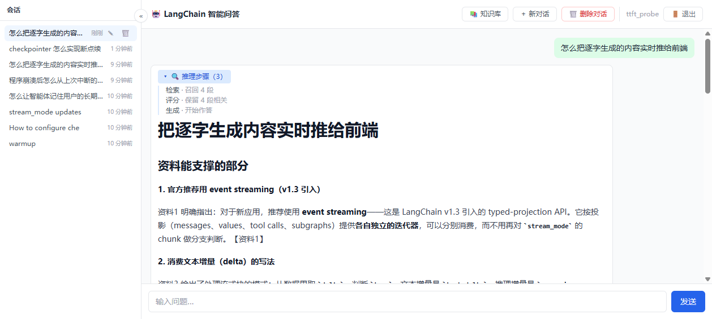
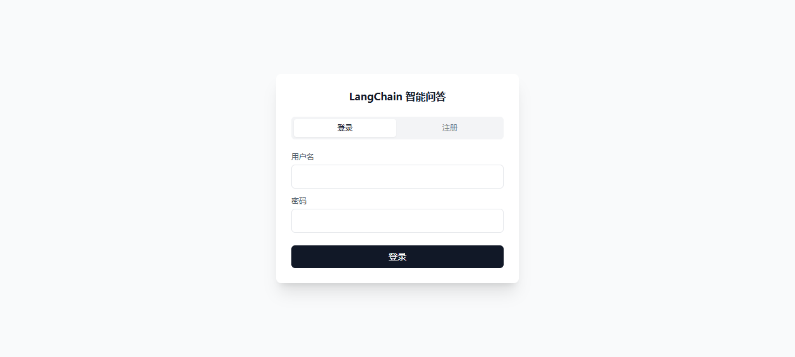
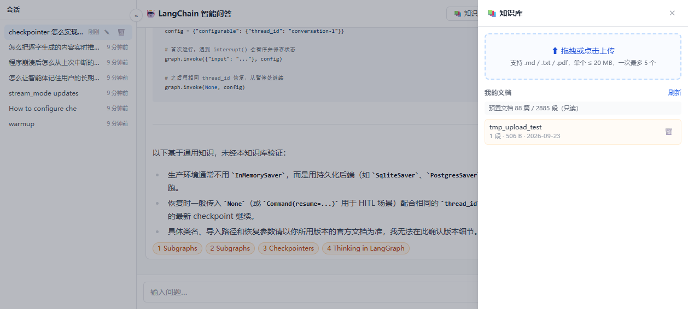
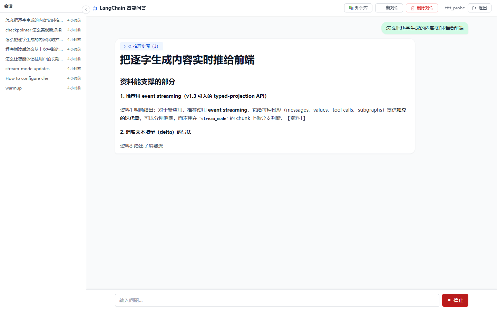

# LangChain 智能问答助手

基于 **CRAG（Corrective RAG）** 的全栈多用户问答系统：LangGraph 编排「检索 → 评估 → 重写 → 生成」工作流，
FastAPI 以 SSE 流式吐出推理步骤与答案 token，React 前端渲染 Markdown 答案并支持**用户自助上传文档进知识库**。

知识库内容是 **LangChain / LangGraph 官方文档**（88 篇 md，切分后 2885 段向量；加上用户上传件后当前共 3755 段），
所以它同时也是个「问框架文档」的实用工具。

**多用户**：JWT 鉴权 + MySQL 归属表，上传件按 `user_id` 隔离 —— 预置官方文档全局共享，用户上传件仅本人可见
（检索 / 列表 / 删除 / 同名替换四处统一过滤）。

> **接口契约的唯一真相源是 [`docs/api/README.md`](docs/api/README.md) + [`docs/api/openapi.yaml`](docs/api/openapi.yaml)。**
> 要增删字段或事件类型：**先改契约，再改后端实现与前端 `types.ts` / `client.ts`**，保持三者一致。

[](https://github.com/7641751/rag-qa-project/actions/workflows/ci.yml)

**线上地址：<http://47.114.103.158:8080>**（可直接注册使用；Docker Compose 全栈部署）

| | |
|---|---|
| 端点 | 12 个（含 2 个 SSE 流） |
| 测试 | 后端 272 例（全离线）/ 前端 148 例，2026-09-23 实测 |
| 公网延迟 | 首 token 延迟 **p50 1.60s / p95 2.44s**，首个推理步骤 0.33s 可见，见「[首 token 延迟](#首-token-延迟ttft)」 |
| CI | GitHub Actions：push / PR 自动跑 `pytest` + `tsc --noEmit` + `vitest` + `vite build`（[`.github/workflows/ci.yml`](.github/workflows/ci.yml)） |
| 检索评估 | 23 条标注 query 的四配置离线对照，见「[检索评估](#检索评估)」 |



<sub>**推理步骤实时可见**（检索 · 召回 4 段 → 评分 · 保留 4 段相关 → 生成 · 开始作答），
答案逐字流式输出并标注 `【资料N】` 出处，底部是来源芯片。</sub>

| 登录 / 注册 | 知识库管理 | 流式作答中 |
|---|---|---|
|  |  |  |

---

## 技术栈

| 层 | 选型 | 说明 |
|---|---|---|
| 工作流编排 | LangGraph `StateGraph` | 4 节点 + 条件路由 + 重写回环；`AsyncSqliteSaver`（`data/checkpoints.db`）做服务端会话记忆 |
| 生成 / 评估 / 重写 | DeepSeek `deepseek-chat` | `temperature=0.1`，`streaming=True`；评估与重写走 `with_structured_output` |
| 嵌入 | DashScope `qwen3.7-text-embedding` | 云端多语言模型，**单次批量上限 20 条**，全项目统一按 10 条/批写入 |
| 向量库 | Chroma（本地持久化） | 单集合 `langchain_docs`，预置文档与用户上传**同集合**，靠 metadata 区分 |
| 鉴权 | JWT（PyJWT HS256）+ bcrypt | `RAGQA_JWT_SECRET` 必须 ≥ 32 字节（RFC 7518 §3.2），否则**启动即失败**；401/403 分工见契约文档 |
| 关系库 | MySQL 8 + SQLAlchemy 2.0 async（aiomysql） | 用户 / 会话归属（`conversations`）/ 问答事件（`qa_events`）；`mysql_database_url` 为空时快速失败并点名该变量 |
| 缓存 / MQ | Redis 7（**可选依赖**） | cache-aside 读缓存 + Streams 事件流（消费组 / `event_id` 幂等 / 死信）；`RAGQA_REDIS_CACHE_ENABLED=false` 一键回滚，未配 Redis 则整体旁路 |
| 后端 | FastAPI + uvicorn | **12 个端点**，其中 2 个是 SSE 流；`/api/health` 为公开就绪探针 |
| 前端 | React 18 + Vite 5 + TypeScript 5.5 + Tailwind 3 | `react-markdown` + `highlight.js` + `katex` 渲染答案，`fetch` + `ReadableStream` 消费 SSE |
| 可观测 | LangSmith | `.env` 里 `LANGSMITH_TRACING=true` 即自动上报完整调用树与 token 消耗 |
| 部署 | Docker Compose | MySQL + Redis + backend + frontend（nginx 反代 `/api` 与 `/docs`，两个 SSE 端点均已关缓冲） |
| 测试 | pytest（后端）/ vitest（前端） | **后端 272 例 / 前端 148 例**，全部离线跑，零 API 额度（数量见「测试」，按需重新生成） |
| 评估 | 自建检索评估脚本 | 23 条标注 query 的四配置对照（recall / MRR / hit@1 / p50-p95），见「检索评估」 |

---

## 架构

### CRAG 工作流

```
                 ┌──────────┐
                 │  START   │
                 └────┬─────┘
                      ▼
               ┌────────────┐
        ┌─────▶│  retrieve  │  向量检索 top_k 段
        │      └─────┬──────┘
        │            ▼
        │      ┌───────────────┐
        │      │ grade_documents│  LLM 逐段判断相关性（结构化输出）
        │      └─────┬─────────┘
        │            ▼
        │      ◇ 有相关文档? ◇──否，且 rewrites < max_rewrites──┐
        │            │是                                       ▼
        │            │                              ┌──────────────┐
        │            │                              │ rewrite_query │  LLM 改写为更完整的检索式
        │            │                              └──────┬───────┘
        └───────────────────────────────────────────────────┘
                     ▼
               ┌──────────┐
               │ generate │  仅依据检索到的资料作答，禁止编造
               └────┬─────┘
                    ▼
               ┌────────┐
               │  END   │
               └────────┘

  重写次数用尽 → 同样走 generate，输出「知识库中未找到相关信息」兜底
```

### 全栈数据流

```
 React (Vite :5173)                          FastAPI (:8000)                     Chroma
 ─────────────────                          ───────────────                     ──────
 ChatWindow ──POST /api/chat/stream──────▶ chat_service.stream_chat
              ◀── SSE: step/token/           └─ graph.astream(stream_mode=
                       sources/done ────┘         ["updates","messages"])
                                                 ├─ retrieve ─similarity_search▶ langchain_docs
                                                 ├─ grade_documents  (LLM)      3755 段
                                                 ├─ rewrite_query    (LLM)
                                                 └─ generate         (LLM)

 KnowledgeBaseDrawer ─POST /api/kb/documents─▶ upload_service.sse_upload
   UploadZone          ◀── SSE: progress×N ──┘   ├─ parse_and_split  (pypdf / 切分器)
   DocList                   → done ────────┘    ├─ embed_batch ────────────▶ 同一集合
                                                 └─ 原件落盘 data/uploads/     origin="upload"
```

**关键设计：单集合 + metadata 过滤。** 用户上传的文档写进和预置文档**同一个** Chroma collection，
靠 `metadata["origin"]="upload"` 区分。好处是新向量落库后 retriever 立刻能检索到——
**不需要重启服务，也不需要重建/重编译 LangGraph 图**（`get_graph()` 是 `@lru_cache` 单例）。

---

## 项目结构

```
rag_qa_project/                      ← 唯一 Python 源根（见「开发约定 §1」）
├── config.py                        # 配置中心（pydantic-settings，RAGQA_ 前缀覆盖）+ .env 定位与加载
├── ingest.py                        # 预置知识库入库：加载 → 切分 → 嵌入 → Chroma
├── run.py                           # CLI 入口：普通 / 流式 / 调试 / 打印图结构
├── eval_retrieval.py                # 检索离线评估：dense / bm25 / hybrid / hybrid+精排 四配置对照
├── fetch_langchain_docs.py           # 抓取并清洗官方文档 → data/langchain_docs/
├── pytest.ini                       # addopts = -m "not redis"（在线用例显式排除，不靠 skip）
├── requirements.txt                 # 可读依赖清单（实际安装以 pyproject.toml + uv 为准；Docker 按行安装）
├── Dockerfile / docker-compose.yml  # 全栈部署（MySQL + Redis + backend + frontend nginx）
├── scripts/
│   ├── migrate_kb_user_id.py        # P3 一次性迁移：给旧上传件补 user_id（--dry-run / --yes）
│   └── measure_ttft.py              # 首 token 延迟实测（可 --spawn-server 自己拉起后端；见「TTFT」）
│
├── backend/                         # 只放生产代码（教学 demo 已移到 docs/examples/）
│   ├── tools/                       # 无业务语义的通用能力层
│   │   ├── upload_function_tools.py # SSE 帧 / 错误响应 / 解析切分 / 嵌入 / metadata 查询
│   │   ├── mysql_db_tools.py        # SQLAlchemy async 引擎 / 会话工厂 / init_db / aclose_db
│   │   ├── redis_cache_tools.py     # 连接池 / cached_json / invalidate / 降级封装
│   │   ├── security.py              # bcrypt 哈希 + JWT 签发与校验
│   │   └── http_tools.py            # HTTP 客户端辅助
│   └── app/                         # 业务层：只做编排，不碰底层细节
│       ├── models.py                # ORM：User / Conversation / QaEvent
│       ├── agent/
│       │   ├── graph.py             # LangGraph 工作流 + 单例工厂（get_model/get_vectorstore/get_graph）
│       │   └── schemas.py           # RAGState、结构化输出 schema、请求/响应模型
│       ├── api/
│       │   ├── main.py              # FastAPI 装配：lifespan（DB/Redis/消费端）、CORS、/api/health
│       │   ├── deps.py              # 依赖注入：当前用户、可选 Redis
│       │   ├── errors.py            # 统一错误码与异常处理器
│       │   ├── auth_router.py       # /api/auth/*     注册 / 登录 / me
│       │   ├── chat_router.py       # /api/chat/*     流式问答 / 历史 / 会话列表
│       │   └── kb_router.py         # /api/kb/*       上传 / 列表 / 删除
│       └── services/
│           ├── chat_service.py      # 双模式流式（updates + messages）、节点过滤、历史读取、MQ 生产
│           ├── upload_service.py    # 上传 SSE 流：逐批进度、取消回滚、同名替换
│           ├── auth_service.py      # 注册 / 登录用例
│           ├── conversation_service.py  # 会话归属与列表（MySQL 真相源）
│           └── qa_event_consumer.py # 问答事件消费组：幂等落库 + 死信
│
├── frontend/
│   ├── src/api/                     # client.ts（SSE 解析）+ types.ts（对齐 openapi.yaml）+ tokenStore.ts
│   ├── src/components/              # ChatWindow / MessageBubble / StepTrace / SourceChips /
│   │                                # AnswerMarkdown / Composer / Header / Sidebar /
│   │                                # ConversationItem / LoginPage / ConfirmDialog /
│   │                                # KnowledgeBaseDrawer / UploadZone / DocList
│   ├── src/hooks/                   # useChat / useThreadId / useKnowledgeBase /
│   │                                # useConversations / useSidebar / useAuth
│   ├── src/test/                    # vitest（jsdom）14 个测试文件 / 148 例
│   ├── nginx.conf / Dockerfile      # 多阶段构建：Node 打包 → nginx 托管并反代 /api
│   └── mock/server.mjs              # 无后端时联调用：npm run mock 监听 :8000，实现全部 12 个端点
│
├── data/
│   ├── langchain_docs/              # 88 篇清洗后的官方文档 md（+ INDEX.md 目录，入库时跳过）
│   ├── chroma_db/                   # 向量库持久化目录（ingest 后生成；可重建的派生数据）
│   ├── checkpoints.db               # LangGraph 会话状态（SQLite checkpointer）
│   ├── eval_queries.json            # 检索评估的标注集（**源**，进库）
│   ├── eval_results.json            # 评估产物（可重建，不进库）
│   └── uploads/                     # 用户上传的原件（自动生成；向量库的真相源）
│
├── docs/
│   ├── api/                         # README.md（契约）/ openapi.yaml / sse-example.txt / kb-sse-example.txt
│   ├── screenshots/                 # README 用的 4 张实拍图（登录 / 推理步骤 / 流式 / 知识库）
│   ├── examples/sse_upload_demo.py  # SSE 上传最小教学 demo（不碰 LangChain，可单独跑）
│   └── superpowers/                 # 6 篇设计 spec + 8 篇实施 plan（P1→P4 + 部署 + 简历化改进）
│
└── tests/                           # 26 个文件 / 272 例，全部离线（DI 注入 Fake 模型与向量库）
    └── fixtures/big_sample.md       # 「重复 chunk」分析的样本（非生产数据）
```
└── tests/
    ├── test_graph.py                # 11 个用例：图结构、端到端路由、节点单元、路由分支
    └── test_kb_upload.py            # 14 个用例：metadata 落地、SSE 时序、错误码、回滚、幂等
```

---

## 快速开始

### 0. 前置：`.env`

`.env` 由 `config.py` 的 `_find_env_file()` **由外向内**逐级查找（`RAGQA_ENV_FILE` 可显式指定）：

```
① RAGQA_ENV_FILE 环境变量指定的路径
② <PROJECT_DIR>/../../.env     monorepo 布局（外层的开发配置）
③ <PROJECT_DIR>/../.env        中间层
④ <PROJECT_DIR>/.env           独立仓库根 / docker 镜像内（/app/.env）
                               ← 本仓库用的是这个（PROJECT_DIR = 仓库根）
```

> `PROJECT_DIR` = `config.py` 所在目录，也就是项目根。

> ⚠️ 顺序是**由外向内**、不是「就近优先」。因为 monorepo 布局下同时存在两个用途不同的 `.env`
> （开发用 `<仓库根>/.env` 含数据库连接串；docker compose 用 `rag_qa_project/.env` 只有容器密码），
> 就近优先会让本地开发读到 docker 那份、少了 `RAGQA_MYSQL_DATABASE_URL` 而启动失败。

**必填项**（少一个都起不来）：

```ini
DEEPSEEK_API_KEY=sk-...                        # 生成 / 评估 / 重写
DASHSCOPE_API_KEY=sk-...                       # 文本嵌入 + 精排
RAGQA_JWT_SECRET=<openssl rand -hex 32 的输出>  # ≥32 字节，否则启动期直接抛 ValueError
RAGQA_MYSQL_DATABASE_URL=mysql+aiomysql://user:pw@127.0.0.1:3306/ragqa
REDIS_URL=redis://127.0.0.1:6379/0             # 可选，不配则缓存与事件流整体旁路
```

**可选项**：

```ini
LANGSMITH_TRACING=true           # 开启调用链追踪
LANGSMITH_API_KEY=...
LANGSMITH_PROJECT_NAME=...
```

> `RAGQA_JWT_SECRET` 的长度在**启动期**就校验（HS256 的 HMAC 密钥要 ≥32 字节，RFC 7518 §3.2），
> 而不是等第一次签发 token 才警告 —— 早失败比晚失败好排查。
>
> ⚠️ **pydantic-settings 的 `env_file` 只喂给 `Settings` 模型、不会写进 `os.environ`**，
> 而 `DashScopeEmbeddings` / `ChatDeepSeek` 是用 `os.getenv` 取 key 的 —— 所以 `config.py` 里
> 显式调了一次 `load_dotenv`，**别删**。

### 1. 安装依赖

依赖由仓库根的 `pyproject.toml` + `uv` 管理（`requirements.txt` 只是可读清单，供 Docker 构建按行安装）：

```bash
uv sync                                    # 或：.venv\Scripts\activate
```

前端另装：

```bash
cd frontend
npm install
```

> 下文命令一律以**项目根目录**为基准（独立仓库即仓库根；monorepo 布局下是
> `advanced_tutorial/rag_qa_project/`）。

### 2. 入库（首次必跑）

```bash
python ingest.py                # 幂等：库已存在则跳过
python ingest.py --force        # 重建：先删 collection 再重新嵌入
```

预期输出：`加载文档: 88 篇` → `切分 chunks: 2885 段` → `入库完成: 2885 条向量`。
按 10 段/批写入（DashScope 上限 20，留余量），全量入库约需数分钟。

### 3. 起后端

```bash
python -m uvicorn backend.app.api.main:app --port 8000 --reload
# ← 必须把「项目根目录」当工作目录启动，见「开发约定 §1」
```

自检（实测输出）：

```bash
curl -s http://127.0.0.1:8000/api/health
# {"status":"ok","kb_count":3755,"model":"qwen3.7-text-embedding"}

curl -s http://127.0.0.1:8000/api/kb/documents
# {"documents":[],"builtin":{"docs":88,"chunks":2885}}   ← 需带 Authorization 头，见契约文档
```

交互式文档：<http://127.0.0.1:8000/docs>

### 4. 起前端

```bash
cd frontend
npm run dev                     # http://localhost:5173
```

Vite 已配好 proxy，把 `/api` 转发到 `:8000`，所以前端代码里一律用相对路径，不存在 CORS 问题。

**后端还没写好时**，可以用 mock 顶替（同样监听 `:8000`，实现全部 12 个端点）：

```bash
npm run mock
```

### 5. 起全栈（Docker Compose，可选）

不想手工配 MySQL / Redis 时，一条命令起全栈（MySQL + Redis + 后端 + 前端 nginx）：

```bash
cp .env.example .env        # 填 DEEPSEEK_API_KEY / DASHSCOPE_API_KEY / RAGQA_JWT_SECRET
docker compose up -d --build
# 打开 http://localhost:8080（/docs 也经 nginx 反代可看）
```

要点：

- **数据复用**：Chroma 向量库 / 上传件 / 会话 checkpoints 挂载宿主机 `./data`——不重复入库；
- **网络**：MySQL / Redis 只在容器网络内（不占宿主机端口），密码由 `.env` 控制；前端 nginx 反代 `/api` 与 `/docs`，两个 SSE 端点已关缓冲（保证逐 token 流式）；
- **密钥只走环境变量**（`.env` 已被 `.gitignore` 忽略），不会烘进镜像；
- **前置**：Docker Desktop 需可用的 WSL2（`wsl --install` 后重启一次）；Docker Hub 拉取慢时给 Docker 配代理或镜像加速。

---

## CLI 用法

不想起 Web 服务时，`run.py` 提供三种模式：

```bash
python run.py --graph                                     # 打印 ASCII 工作流结构图
python run.py "RecursiveCharacterTextSplitter 怎么用？"     # 普通：一次性输出答案
python run.py "LangGraph 怎么做持久化？" --stream           # 流式：token 实时打印
python run.py "如何构建 RAG agent？" --debug                # 调试：打印每个节点执行后的状态增量
```

> ⚠ **CLI 的检索范围与网页端不同，这是刻意的**：`run.py` 无登录态，调
> `build_graph()` 时 `user_id=None`，于是 `retrieve` 节点用的过滤条件是
> `{"kb": "langchain_docs"}` —— **只检索 88 篇预置官方文档，不检索任何用户上传件**。
> 无登录态时无从判断「该看谁的上传件」，放开就等于所有人能检索所有人的文档。
> 要在 CLI 里验证上传件的检索效果，请改用网页端（带 token 后会注入真实 `user_id`）。

---

## HTTP 接口

**共 12 个端点**（完整契约见 [`docs/api/README.md`](docs/api/README.md)）：

| 方法 | 路径 | 用途 | 需登录 | 响应 |
|---|---|---|---|---|
| `POST` | `/api/auth/register` | 注册 | — | `application/json` |
| `POST` | `/api/auth/login` | 登录，换取 JWT | — | `application/json` |
| `GET` | `/api/auth/me` | 当前登录用户 | ✅ | `application/json` |
| `POST` | `/api/chat/stream` | 提问并流式作答 | ✅ | `text/event-stream` |
| `GET` | `/api/chat/history?thread_id=` | 拉取会话历史（checkpointer 是真相源） | ✅ | `application/json` |
| `GET` | `/api/chat/threads` | 列出本人会话（倒序，最多 50 条） | ✅ | `application/json` |
| `PATCH` | `/api/chat/threads/{thread_id}` | 重命名会话 | ✅ | `application/json` |
| `DELETE` | `/api/chat/threads/{thread_id}` | 删除会话的全部服务端状态（幂等） | ✅ | `application/json` |
| `POST` | `/api/kb/documents` | 上传文档并入库（SSE 进度） | ✅ | `text/event-stream` |
| `GET` | `/api/kb/documents` | 列出本人上传的文档 | ✅ | `application/json` |
| `DELETE` | `/api/kb/documents/{doc_id}` | 删除上传文档的全部向量块 | ✅ | `application/json` |
| `GET` | `/api/health` | 健康检查 / 就绪探针 | — | `application/json` |

> 「需登录」= 必须带 `Authorization: Bearer <access_token>`，缺失 / 过期 / 被篡改一律 `401`。
> `/api/health` 保持公开 —— 网关与容器健康检查不会带 token。

### SSE 事件

**聊天**（`/api/chat/stream`）：`step` × N → `token` × N → `sources` → `done`；出错发 `error` 后关流。

- `step`：`{"node","label","detail"}`，`node ∈ {retrieve, grade_documents, rewrite_query, generate}`
- `token`：`{"text"}`，**只来自 `generate` 节点**——必须过滤掉 `grade` / `rewrite` 的 JSON 结构化输出，否则答案流里会混进垃圾
- `sources`：`{"sources":[{"title","snippet","score"}]}`，生成结束前一次性给出
- `done`：`{"thread_id","rewrites"}`

**上传**（`/api/kb/documents`）：`progress(saved)` → `progress(parsed)` → `progress(split)` → `progress(embedding)` × N → `done`。

- `progress`：`{"stage","current","total","message"}`。后端只报事实，**百分比映射由前端决定**
  （`split` 当 20% 基线，`embedding` 按 `current/total` 在 20%→100% 插值）
- `current` 是**累计已嵌入段数**，不是批次起点；最后一帧必然等于 `total`
- `done`：`{"doc_id","filename","chunks","replaced","uploaded_at"}`

### 错误处理：两段式

- **流开始前**（还没发 200 响应头）→ 用标准 HTTP 状态码，错误体统一 `{"code","message"}`：
  `415 UNSUPPORTED_FILE_TYPE` / `413 FILE_TOO_LARGE` / `422 VALIDATION_ERROR` / `404 NOT_FOUND`
- **流开始后**（响应头已出去，改不了状态码）→ 发 `event: error`：
  `PARSE_ERROR` / `EMPTY_DOCUMENT` / `EMBEDDING_ERROR` / `LLM_ERROR` / `INTERNAL_ERROR`

> 上传端点的校验必须在返回 `StreamingResponse` **之前**做完，否则 415/413 只能降级成 SSE error，前端要写两套处理。
> **禁止**返回 200 却在 body 里塞错误文本。

---

## 知识库上传

### metadata 约定

上传文档的**每个向量块**写入时就必须带齐：

| 字段 | 必填 | 值 | 用途 |
|---|---|---|---|
| `doc_id` | ✅ | `uuid4()` | 删除 / 替换 / 回滚的定位键 |
| `filename` | ✅ | 原始文件名 | 列表展示、同名检测 |
| `origin` | ✅ | 固定 `"upload"` | 与预置文档区分 |
| `uploaded_at` | ✅ | ISO 8601 UTC | 列表排序与展示 |
| `chunk` | ✅ | 段序号（从 0 连续） | 还原原文顺序 |
| `title` | 可选 | md 取首个 `# 标题`，否则回退文件名 | 列表展示、来源芯片 |
| `source` | 建议 | `uploads/<doc_id>__<filename>` | 与预置文档的 `source` 语义一致 |
| `size_bytes` | 可选 | 整数 | 列表展示 |

预置的 88 篇文档**保持现状不带 `origin` 字段**（无需重建），因此 `where={"origin":"upload"}` 天然只匹配上传项，
删除时也不需要额外的 403 分支——命中 0 条直接 404。

### 三条行为约定

1. **同名视为替换**：按 `filename + origin=upload` 找到旧 `doc_id`，先删旧向量与旧落盘原件，再按新 `doc_id` 入库，`done.replaced=true`。
2. **中途取消必须回滚**：用户点取消 → fetch abort → 后端异步生成器收到 `asyncio.CancelledError`（实测，**不是** `GeneratorExit`）。
   此时已写入的向量是「半截」的，会污染检索，必须按 `doc_id` 连向量带原件一起清掉，保证「要么整个文档入库成功，要么库里干干净净」。
3. **原件必须落盘** `data/uploads/`：向量库是可重建的派生数据，`ingest.py --force` 重建时靠这些原件把用户文档捞回来，否则一次重建 = 用户资料永久丢失。

### curl 自测

```bash
# 上传（-N 关闭 curl 缓冲，才能看到逐帧进度）
curl -N -X POST http://localhost:8000/api/kb/documents -F "file=@/path/to/notes.md"

# 强制中断，验证回滚（服务端日志会打印「收到 asyncio.CancelledError」+ 清除段数）
curl -N -m 1 -X POST http://localhost:8000/api/kb/documents -F "file=@/path/to/big.pdf"

# 列表 / 删除
curl -s http://localhost:8000/api/kb/documents
curl -s -X DELETE http://localhost:8000/api/kb/documents/<doc_id>
```

实测一次成功上传的完整事件流：

```
event: progress
data: {"stage": "saved", "message": "已接收 notes.md (0.1 KB)"}

event: progress
data: {"stage": "parsed", "message": "解析出 23 字符"}

event: progress
data: {"stage": "split", "current": 1, "total": 1, "message": "切分为 1 段"}

event: progress
data: {"stage": "embedding", "current": 1, "total": 1, "message": "嵌入 1/1"}

event: done
data: {"doc_id": "d68ae53c-...", "filename": "notes.md", "chunks": 1,
       "replaced": false, "uploaded_at": "2026-09-13T04:42:36Z"}
```

### 限额

| 项 | 值 | 由谁强制 |
|---|---|---|
| 扩展名白名单 | `.md` / `.txt` / `.pdf`（大小写不敏感） | 前端预校验 + 后端 `415` |
| 单文件大小 | ≤ 20 MB（20971520 字节） | 前端预校验 + 后端 `413` |
| 单次选择文件数 / 并发上传数 | ≤ 5 / 1（串行） | 仅前端 |
| 嵌入批大小 | 10 段/批 | 后端（DashScope 上限 20，留余量） |
| 上传超时 | **不设 timeout** | 前端靠 `AbortController` 让用户取消 |

---

## 多用户与数据隔离（P3）

- **检索范围**：`{"$or":[{"kb":"langchain_docs"},{"user_id":<自己>}]}` —— 88 篇预置官方文档对
  所有登录用户共享，**上传件仅本人可见**（检索、列表、删除、同名替换四处统一按 `user_id` 过滤）。
- **删别人的文档 → `404`**（不是 403）：403 会泄露「该 `doc_id` 存在但不属于你」，
  而 404 与「这个 id 根本不存在」不可区分，零额外代码且不泄露存在性。
- **重命名别人的会话 → `403`**：这里刻意反过来 —— `thread_id` 由前端生成、就写在 URL 里，
  用户本来就知道它存在，403 不构成额外泄露。两个选择出发点不同，详见 `docs/api/README.md`。
- **旧上传件必须先迁移**：P3 之前的向量没有 `user_id`，在本规则下**对所有人都不可见**
  （连原上传者也看不见）。上线顺序**不可颠倒**：

```bash
python scripts/migrate_kb_user_id.py --dry-run   # 核对数量（只读，不写入）
python scripts/migrate_kb_user_id.py --yes       # 实际写入，归给第一个注册的用户
python scripts/migrate_kb_user_id.py --dry-run   # 再跑应为 0 段待迁移（验证幂等）
```

> 先部署代码再迁移 → 从部署到迁移完成这段时间里所有上传件对所有人不可见；
> 先迁移再部署 → 无副作用（多出来的 `user_id` 字段在旧代码下被忽略）。
> 显式指定归属用 `--user <用户名>`。

---

## 缓存与事件流（P4）

**三点定位（比实现更重要）**：

- **缓存是可丢的派生数据，MySQL 才是真相源**：任何 Redis 故障都必须降级回源，
  不得升级为业务故障（写时删键 + 短 TTL 兜底 + 缓存层全部调用都在降级逻辑之内）。
- **授权永不走缓存**：归属校验只读 MySQL；命中缓存的响应在返回前另有归属/结构
  两层自校验（键串了或载荷坏了一律当 miss、并删掉坏键）。
- **事件流只用于统计**：问答成功后 `XADD`（失败只记 warning，绝不影响 SSE 流）→
  消费端落 `qa_events` 表；消费端挂了不影响任何请求，至少一次投递靠 `event_id`
  唯一键做幂等，超过重试上限进死信流（`…:dead`）而不是无限重投。

**回滚开关**：`RAGQA_REDIS_CACHE_ENABLED=false` 一键回到「无缓存」行为（与 P3 逐字一致）；
`.env` 未配 Redis 时同样整体旁路 —— Redis 是可选依赖，缺它不拦启动。

**键与流**（完整设计见 [`docs/superpowers/specs/2026-09-21-redis-cache-and-mq-design.md`](docs/superpowers/specs/2026-09-21-redis-cache-and-mq-design.md)）：

| 键 | 类型 | 用途 | TTL |
|---|---|---|---|
| `ragqa:conv:list:v1:{user_id}` | String(JSON) | 会话列表读缓存（三处写路径 commit 后删键） | 60s（仅兜底） |
| `ragqa:stream:qa_stats` | Stream | 问答事件（`MAXLEN ~ 10000`） | 无 |
| `ragqa:stream:qa_stats:dead` | Stream | 重试仍失败的死信（`MAXLEN ~ 1000`） | 无 |

**诚实声明：本期不带来性能收益**（实测收益 ≈ 0）。它的价值是把「cache-aside + 失效 +
降级 + MQ 派生数据」这套模式在真实代码里走通、为将来真正的热点（检索侧，dense p50 197ms）
备好可复用的工具与降级习惯；将来评估「缓存到底有没有用」的判据应是**命中率与 MySQL
查询计数**，而不是延迟。

---

## 配置项

全部集中在 [`config.py`](config.py)，可用 `RAGQA_` 前缀的环境变量覆盖：

| 配置 | 默认值 | 环境变量 | 说明 |
|---|---|---|---|
| `deepseek_model` | `deepseek-chat` | `RAGQA_DEEPSEEK_MODEL` | 生成 / 评估 / 重写用 |
| `temperature` | `0.1` | `RAGQA_TEMPERATURE` | RAG 场景用低温度，减少编造 |
| `embed_model` | `qwen3.7-text-embedding` | `RAGQA_EMBED_MODEL` | 仅用于 `/api/health` 上报 |
| `top_k` | `4` | `RAGQA_TOP_K` | 每次检索返回段数 |
| `chunk_size` | `1000` | `RAGQA_CHUNK_SIZE` | 技术文档适用；200 会切碎语义且嵌入调用暴增 |
| `chunk_overlap` | `150` | `RAGQA_CHUNK_OVERLAP` | 相邻块重叠，避免语义被截断 |
| `max_rewrites` | `2` | `RAGQA_MAX_REWRITES` | 查询重写上限，防死循环 |
| `collection_name` | `langchain_docs` | `RAGQA_COLLECTION_NAME` | 预置与上传共用一个集合 |
| `chroma_dir` | `data/chroma_db` | `RAGQA_CHROMA_DIR` | 向量库持久化目录 |
| `docs_dir` | `data/langchain_docs` | `RAGQA_DOCS_DIR` | 预置文档目录 |
| `uploads_dir` | `data/uploads` | `RAGQA_UPLOADS_DIR` | 用户上传原件落盘处 |
| `mysql_database_url` | `""`（未配置） | `RAGQA_MYSQL_DATABASE_URL` | MySQL 异步连接串（P2 账号体系用）。默认空串 → 构造引擎前快速失败并点名该变量；**口令只放 .env，不进源码** |
| `sql_echo` | `False` | `RAGQA_SQL_ECHO` | 是否打印全部 SQL。SSE 场景下默认关，否则 SQL 日志会淹没应用日志 |
| `redis_url` | `""`（未配置） | `RAGQA_REDIS_URL` / `REDIS_URL` | 读缓存 + 问答事件流（P4）。**可选依赖**：未配置即整体旁路（行为同 P3）；`.env` 里现用裸 `REDIS_URL` |
| `redis_cache_enabled` | `True` | `RAGQA_REDIS_CACHE_ENABLED` | 一键回滚开关：`false` ⇒ 完全不碰 Redis |
| `conv_cache_ttl` | `60` | `RAGQA_CONV_CACHE_TTL` | 列表缓存 TTL 秒；只作兜底（主策略是写时删键） |
| `qa_stream_key` | `ragqa:stream:qa_stats` | `RAGQA_QA_STREAM_KEY` | 问答统计事件流键名 |

例：`RAGQA_TOP_K=6 python run.py "年假有几天？"`

---

## 测试

```bash
python -m pytest tests -v          # 267 passed, 1 skipped, 4 deselected，约 20 秒
```

```bash
cd frontend
npm run test                       # 148 passed（14 个文件，jsdom），约 4 秒
npm run build                      # tsc --noEmit + vite build（类型检查不过就不出包）
```

> **那 1 个 skip 是有意为之，不是掩盖失败**：`test_auth_service.py:93` 依赖 MySQL 的
> `utf8mb4_0900_ai_ci` 排序规则，而 SQLite 默认大小写敏感，该行为在本地替身上不成立 —— 它留给
> 手工验收，理由写在 skip reason 里。4 个 deselected 是 `pytest.ini` 的 `addopts = -m "not redis"`
> 排除的 Redis 连通性自检（需要真实 Redis，用 `python -m pytest -m redis` 手动触发）。
> 这与本项目的测试纪律一致：**需要真实服务的用例必须显式排除，而不是靠 skip** ——
> skip 会让「配了却连不上」这种最该告警的状态悄悄变绿。

两个测试文件都是**完全离线**的，靠依赖注入把外部服务换掉：

- `test_graph.py`：`build_graph(model=..., vectorstore=...)` 接受任意模型与向量库，
  用 `FakeRAGModel`（按 prompt 内容路由到 grade / rewrite / generate 三种行为）+ `FakeVectorStore` 验证图结构与路由分支。
  后者会**记录每次调用收到的 `filter`**，所以「按用户隔离」的语义可以被直接断言。
- `test_kb_isolation.py`：用 tmp_path 里的真 Chroma 验证归属隔离（谁的文档谁能看见/删/被同名替换命中）。
  用真库而非手写 where 求值器，是因为隔离的成败取决于 Chroma 对 `$and`/`$or` 的真实语义。
- `test_kb_upload.py`：`DeterministicFakeEmbedding` 替换 DashScope、`tmp_path` 里的独立 Chroma 替换真实库、
  `monkeypatch settings.uploads_dir` 隔离落盘目录，用 `TestClient` 跑完整 SSE 时序。

---

## 开发约定（都是踩过的坑）

### 1. import 只用一个根：`rag_qa_project/`

后端内部模块**一律**写全 `backend.app.*` 前缀；只有 `config` 和 `ingest` 允许裸导入
（因为它们物理上就直接躺在源根下）。

```python
# ✅ 正确
from backend.app.agent.graph import get_vectorstore
from backend.tools.upload_function_tools import sse, err
from config import settings

# ❌ 错误 —— 运行时 ModuleNotFoundError（tools 物理在 backend/tools/，源根底下找不到它）
from agent.graph import get_vectorstore
from services.upload_service import sse_upload
from tools.upload_function_tools import sse
```

判别方法：**把 import 的第一段拿去 `rag_qa_project/` 底下找，找得到就合法，找不到就是根错了。**

为什么这条这么重要：Python 的绝对 import 只认 `sys.path`，而 `sys.path[0]` 由启动方式决定
（`python -m uvicorn` / `pytest` 都是当前工作目录）。所以**必须在 `rag_qa_project/` 目录下启动后端**。

⚠ **PyCharm 用户额外注意**：如果 `.iml` 里把 `backend/` 和 `backend/app/` 也标成了 Sources Root，
IDE 会把三个根都当解析路径，于是裸写法**在编辑器里不报红、一到命令行就炸**。更隐蔽的后果是同一个 `.py`
被加载成两个互不相干的模块对象（`sys.modules` 里 `agent.graph` 和 `backend.app.agent.graph` 并存）：

- `get_vectorstore()` 的 `@lru_cache` 单例失效 → 开出两个 Chroma 客户端 + 两个嵌入实例，
  一份代码写进去的向量另一份的 retriever 看不见（症状：上传成功但搜不到）
- 模块级状态双份 → `monkeypatch` 只打中一半，测试假绿/假红

**请只把项目根目录标成一个 Sources Root** —— 独立仓库就是仓库根；monorepo 布局下是
`advanced_tutorial/rag_qa_project/`。多标一个根就会复现上面两个症状。

### 2. 同步阻塞活儿一律丢 `asyncio.to_thread`

解析、切分、嵌入、Chroma 读写全是同步阻塞的。在异步生成器里直接调用会**占住整个事件循环**，
别的请求（包括正在跑的聊天流）全部卡死。

### 3. 不在 import 期碰向量库

`get_vectorstore()` 会加载 Chroma + DashScope 嵌入。写成模块级变量等于把重活提到进程启动，
知识库没入库时整个 app 都起不来。它是 `@lru_cache` 单例，**函数里现取即可，开销只是一次字典查找**。

同理：`@lru_cache` 不能装饰带 `embeddings` 参数的函数——LangChain 的嵌入对象继承自 pydantic
`BaseModel`，不可哈希，会抛 `TypeError: unhashable type`。改为无参、在函数内部构建。

### 4. Chroma 的两条硬约束

- `add_documents()` **只接受 `Document` 对象**。直接喂 `list[str]` 会抛
  `AttributeError: 'str' object has no attribute 'id'`。纯文本必须自己包 `Document(page_content=..., metadata=...)`。
- `where` 里的 `$and` / `$or` **至少要两个子条件**。单条件必须直接写 `{"origin": "upload"}`，
  包一层 `$and` 会抛 `ValueError: ... at least two where expressions`。

另外：`collection.get()` 的 `include` **必须显式给**。省略时 Chroma 会连 `documents` 一起返回，
上传几百段就是数 MB 无用数据。只要计数用 `include=[]`，要分组统计用 `include=["metadatas"]`。
`delete(where=...)` 未命中是静默 no-op，且不返回条数——要拿删除数得先 `get` 数一遍 ids。

### 5. SSE 帧格式与响应头

```python
f"event: {event}\ndata: {json.dumps(data, ensure_ascii=False)}\n\n"   # 空行结束一帧
```

响应头必须含 `X-Accel-Buffering: no`，否则 nginx / 反向代理会把帧憋住，失去流式效果。

### 6. 路由函数必须 `return` 响应对象

`return await upload_service.sse_upload(file)` —— 漏掉 `return` 会把 `StreamingResponse` 丢弃，前端只能拿到 `null`。

---

## 调试手段

1. **结构可视化**：`python run.py --graph` 输出 ASCII 架构图。
2. **步骤级调试**：`--debug` 以 `stream_mode="updates"` 打印每个节点执行后的状态增量。
3. **节点内日志**：`graph.py` 各节点内置 `print`（检索命中标题、评分保留数、重写内容），
   `upload_service.py` 打印入库完成 / 回滚 / 各类中断异常。
4. **LangSmith 追踪**：`.env` 里 `LANGSMITH_TRACING=true`，每次运行自动上报，
   可在 <https://smith.langchain.com> 查看完整调用树、token 消耗与每个节点的输入输出。
5. **前端 mock**：`npm run mock` 起一个假后端，把前后端联调和后端开发解耦。
6. **教学 demo**：`docs/examples/sse_upload_demo.py` 是不依赖 LangChain/Chroma 的最小 SSE 上传实现，
   专门用来观察「客户端中断时异步生成器到底收到哪个异常」（`asyncio.CancelledError`，**不是** `GeneratorExit`）。
   在 `docs/examples/` 目录下跑：`python -m uvicorn sse_upload_demo:app --port 8010`

---

## FAQ

**Q1：`certificate verify failed ... huggingface.co`？**
`HF_ENDPOINT` 镜像必须在任何 langchain / chromadb / huggingface_hub 导入**之前**设置
（`huggingface_hub` 会在首次导入时固化 endpoint）。现已在 `config.py` 顶部处理，
所有入口 import config 时都会生效。当前嵌入走 DashScope 云端 API，一般不会再触发 HF 下载。

**Q2：回答只涵盖资料的一部分？**
切分粒度 + 相关性过滤的典型现象。改进方向：调大 `RAGQA_TOP_K`、调大 `RAGQA_CHUNK_SIZE`，
或放宽 grade 的判定标准（`config.py` 的 `grade_strict`）。

**Q3：一直触发 rewrite 循环？**
`max_rewrites=2` 是防死循环安全阀；耗尽后走 generate 的「未找到」兜底分支，不会无限循环。

**Q4：上传成功但问答搜不到新内容？**
先确认没有踩「开发约定 §1」的重复模块坑（两个 `get_vectorstore` 单例 → 写入和检索用的不是同一个 Chroma 实例）。
用 `curl /api/health` 看 `kb_count` 有没有涨，再用 `GET /api/kb/documents` 确认 `origin=upload` 的块在不在。

**Q5：怎么不花 API 额度做回归测试？**
见「测试」一节。两个注入点是 `build_graph(model=..., vectorstore=..., checkpointer=...)`
和 `monkeypatch backend.tools.upload_function_tools.get_vectorstore`，
272 个后端用例（267 通过 + 1 有意 skip + 4 在线用例排除）全部离线跑通。

**Q6：换其他 LLM / 其他向量库？**
`graph.py` 的 `get_model()` / `get_vectorstore()` 是仅有的两处基础设施绑定，替换它们即可
（`retrieve` 节点直接调 `vectorstore.similarity_search(query, k=, filter=)`，
所以换向量库时**必须支持 `filter` 参数** —— 租户隔离靠的就是它）。

**Q7：上传件对别人可见吗？**
不可见。检索范围是 `{"$or":[{"kb":"langchain_docs"},{"user_id":<自己>}]}` ——
预置的 88 篇官方文档全局共享，上传件仅本人可见（检索 / 列表 / 删除 / 同名替换四处统一过滤）。
P3 之前的旧上传件没有 `user_id`，必须先用 `scripts/migrate_kb_user_id.py` 补迁移。

---

## 已知问题

### 已修复（留档，因为排查过程本身有价值）

**① 兜底分支不产生 `token` 帧** —— ✅ 已修。

- **症状**：未命中知识库时前端答案气泡**完全空白**。实测事件序列 `['step']×8 → 'sources' → 'done'`，
  `token` 帧数 = 0。
- **根因**：`generate` 节点在 `documents` 为空时直接 `return {"generation": "知识库中未找到…"}`，
  **没有调用 model**，于是 `stream_mode="messages"` 一个 `AIMessageChunk` 都推不出来。
- **修法（双保险）**：① `graph.py` 的 `_answer_without_kb` 改为真调 model 用自有知识作答
  并自声明未经验证；② `chat_service.py` 再加一层 —— 全程没推过任何 token 却拿到了 `generation`，
  就在 `done` 之前补发 `step(generate)` + 一帧 `token`，保证事件序恒为 `…step → token → sources → done`。
- **回归线**：`tests/test_chat_stream.py::test_fallback_path_emits_token_frame_and_marks_ungrounded`
  把这行为钉死了；`graph.py:266-273` 记录了「为什么不拆成两个 LangGraph 节点」
  （`chat_service` 靠 `meta["langgraph_node"] == "generate"` 过滤 token，拆节点会把兜底路径的 token 整条丢掉）。

### 未修复

**② 离线指标与线上体验脱节**（本项目最值得说的一处）。

- **现象**：`eval_retrieval.py` 在 23 条标注 query 上跑出 **dense recall@5 = 100%、MRR 0.978、hit@1 95.7%**，
  看起来检索毫无问题。但线上问「RecursiveCharacterTextSplitter 怎么切分 markdown」时，
  `top_k=4` 命中的全是 *Build a semantic search engine* 这类教程页，`grade` 连续三轮判 0/4 相关，
  重写耗尽后走兜底。
- **根因有两层**：
  1. **口径不一致**：评测判定是**文档级**的（`is_hit`：top-k 里任一段来自 `expected_sources` 之一即算命中），
     而线上 `grade_documents` 是**段级**的（LLM 逐段判断这段能不能回答问题）。
     「命中文档 X」不等于「命中的那一段有用」—— 命中的是教程页里顺带提到 splitter 的段落，
     grade 判 False 其实是**正确的**。
  2. **评测集有选择偏差**：23 条 query 分布为 `term_en 8 / semantic_zh 8 / upload_zh 7`，
     而 `term_en` 全是 LangGraph 核心 API 名、`semantic_zh` 全是 LangGraph 概念 ——
     **恰好都是「术语可精确匹配、文档主题明确」的简单 query**，没有一条是「概念分散在多个教程页、
     需要跨文档综合」的困难 query，而线上翻车的正是这种。
- **改进方向**（注意：**不是**「上更高级的检索」）：
  - 评测集补困难样本 + 加 `expected_keywords` 做**段级判定**，让口径与线上一致；
  - 新增**端到端指标**：兜底率、平均重写次数、首 token 延迟（TTFT）—— 文档级 recall 100% 却答不出来，
    说明缺的正是 e2e 指标；
  - 在评测数据支撑下再调 `grade_strict` / `top_k`。

> **为什么不上 hybrid 检索**：`data/eval_results.json` 实测 hybrid（RRF 0.6/0.4）相对 dense
> **recall 零增益**（都是 100%），却把 **hit@1 从 95.7% 打到 60.9%**、MRR 从 0.978 打到 0.771
> （原因是 RRF 对重复内容累加计分，重复 chunk 被顶到前面）。
> 所以「不引入 BM25」是数据驱动的决策，而不是偷懒 —— 详见下方「检索评估」。

**③ 缓存不可达时，每次提问在 SSE 响应头之前同步白等 3 秒**（本机实测，2026-09-22）。

> ✅ **公网部署没有这个问题**（2026-09-23 复测）：compose 内 Redis 用服务名互访，可达；
> 公网首事件 p50 = 0.33s，与本机「绕开 Redis」的 0.25s 基本一致。
> 所以这是**本机 `.env` 配置**问题（`REDIS_URL` 指向一台不在线的虚拟机），不是代码缺陷 ——
> 但下面这条**设计层面的观察**依然成立：缓存不可达时的 3 秒会落在响应头之前。

- **现象**：`POST /api/chat/stream` 的 **200 响应头要 3073ms 才到达**。
  对照 —— `GET /api/health` 28ms、`GET /api/auth/me`（同样走 MySQL）19ms；
  而**进程内**直接跑图、跑到第一个 `update` 只要 **281ms**。
  即：这 ~2.8s 全部花在「进图之前」，与检索、LLM 都无关。
- **定位**：`chat_router.py` 在返回 `StreamingResponse` **之前** `await chat_service.prepare_stream(...)`，
  它内部依次做 `assert_owner` → `upsert_conversation` → **`commit`** → `await invalidate(redis, …)`。
  前三步走本地 MySQL（十几毫秒），最后一步在 Redis 不可达时白等 `socket_connect_timeout=3`
  （`main.py` 里显式设的 3s 上限，注释还写了「Redis 主机黑洞时每次连接尝试要白等 5010ms」）。
- **成因**：`.env` 的 `REDIS_URL` 指向 `192.168.88.130:6379`（VMware NAT 网段的虚拟机），
  该地址当时不可达。**项目自带的连通性自检 `pytest -m redis` 当时就是红的**
  —— 这正是 `pytest.ini` 坚持「需要真实服务的用例必须显式排除而不是 skip」的价值：
  它没被 skip 掩盖，只是没人跑。
- **对照实验**（同一台机器、同一份代码，用项目自己的回滚开关只改 Redis 可达性）：

  | 指标 | `REDIS_URL` 指向不可达地址 | `RAGQA_REDIS_CACHE_ENABLED=false` | 差值 |
  |---|---|---|---|
  | 首事件 p50 | 3.40s | **0.25s** | **−3.15s** |
  | 首 token 延迟 p50 | 4.83s | **1.71s** | **−3.12s** |
  | 端到端总耗时 p50 | 10.99s | 5.00s | −5.99s |

  差值 3.12s 与 `socket_connect_timeout=3` 精确吻合。15 次采样极稳（TTFT min 4.29 / max 5.45），
  所以**不是冷启动**。
- **为什么「降级设计」没兜住**：P4 的承诺是「缓存故障**不得升级为业务故障**」——
  这一点**确实做到了**：Redis 挂了请求仍返回 200、答案仍正确、`grounded` 仍为 true。
  但它只承诺了**功能**不降级，**没承诺延迟不劣化** —— 而 3 秒恰好落在用户等待最敏感的那段路径上
  （响应头之前，连「正在检索」的 `step` 帧都还没发出去，用户看到的是纯白屏）。
- **修法（两选一，都还没做）**：
  1. **配置层**（本次的直接成因）：把 `REDIS_URL` 指向可达实例，并让 `pytest -m redis` 进 CI
     —— 现在 CI 只跑离线用例，这类「环境配了却连不上」的问题 CI 看不见；
  2. **代码层**：把 `invalidate` 移出「响应头之前」的关键路径（`BackgroundTasks` 或
     `asyncio.create_task`）—— 「先 commit 后 DEL」的顺序仍然成立（删键本就是 best-effort，
     有 60s TTL 兜底）。更彻底的是加**熔断**：连续 N 次失败后一段时间内直接跳过 Redis，
     避免每个请求都重付一次超时。

---

## 检索评估

检索要不要加东西，**由数据决定，而不是由「看起来更高级」决定**。`eval_retrieval.py` 提供四配置离线对照：

```bash
uv run python eval_retrieval.py                    # 单组权重 0.6,0.4 + 云端精排
uv run python eval_retrieval.py --sweep            # 扫六组 RRF 权重，再按最优权重精排
uv run python eval_retrieval.py --quick            # 只跑前 3 条（冒烟）
uv run python eval_retrieval.py --no-rerank        # 跳过精排（零 rerank API 调用）
uv run python eval_retrieval.py --detail           # 打印每条 query 的各配置 top-5
```

**实测结果**（`data/eval_results.json`，23 条标注 query，k=20 → top_n=5，语料 3755 段）：

| 配置 | recall@5 | MRR | hit@1 | p50 | p95 |
|---|---|---|---|---|---|
| **dense**（线上基线） | **100.0%** | **0.978** | **95.7%** | 338ms | 465ms |
| bm25 | 69.6% | 0.588 | 52.2% | 11ms | 16ms |
| hybrid（RRF 0.6/0.4） | 100.0% | 0.771 | 60.9% | 351ms | 546ms |
| hybrid_rerank | 见 `--sweep` 输出 | — | — | — | — |

**结论：不引入 hybrid 检索。** 理由是实打实的两个数字 —— 相对 dense，hybrid 的
**recall 零增益**（都是 100%，即融合没有救回任何一条 dense 漏掉的），
却把 **hit@1 从 95.7% 打到 60.9%**、MRR 从 0.978 打到 0.771。

原因写在脚本注释里：RRF 对**重复内容累加计分**（官方 `EnsembleRetriever` 源码原文
`"Duplicated contents across retrievers are collapsed & scored cumulatively"`），
语料里的重复 chunk 一旦被同一路检索多次召回就会叠加分数、挤掉真正的最优项。

> ⚠ **这张表有一个必须说明的局限**（面试被追问时的关键）：评测判定是**文档级**的
> （top-k 里任一段来自 `expected_sources` 之一即算命中），而线上 `grade_documents` 是**段级**的。
> 所以这里的 `recall = 100%` **不代表线上体验好** —— 详见「已知问题 ②」。
> 这也说明：**指标口径设计错了，100% 的指标反而是有害的**，它会掩盖真问题。

BM25 索引的两个真实成本（冷启动时打印）：全量建索引约 2.2s、常驻几十 MB，
且它是**静态快照** —— 知识库上传后必须 `cache_clear()` 重建，否则新文档在稀疏检索里不可见。

---

## 首 token 延迟（TTFT）

recall / MRR 只回答「找得到吗」，不回答「要等多久」。用户体感的是**首 token 延迟** ——
从点下发送到第一段文字出现，中间夹着：检索 → 相关性评分 →（可能）重写 → 生成的首个 token。

```bash
uv run python scripts/measure_ttft.py                  # 对着已在跑的服务测（默认 127.0.0.1:8000）
uv run python scripts/measure_ttft.py --spawn-server    # 自己拉起后端再测（一条命令出一个数字）
uv run python scripts/measure_ttft.py --n 3             # 每条查询重复 3 次，看分位数
uv run python scripts/measure_ttft.py --base-url http://<IP>:8080   # 量公网真实延迟
```

**实测**（5 条查询，`--n 1`）：

| 指标 | 公网（`http://47.114.103.158:8080`） | 本机（Redis 已绕开） |
|---|---|---|
| 首 token 延迟（TTFT）　p50 / p95 | **1.60s** / 2.44s | 1.71s / 2.10s |
| 首事件延迟（第一个 `step` 帧，「检索」开始可见） | **0.33s** | 0.25s |
| 端到端总耗时　p50 / p95 | **4.70s** / 6.11s | 5.00s / 5.04s |
| 兜底率（`grounded=false`） | 0/5 | 0/5 |

**拆解**：TTFT ≈ `检索 + 评分`（首事件，**0.33s**）+ `生成首个 token`（≈1.3s，取决于 DeepSeek 首包）。
所以**检索根本不是 TTFT 的瓶颈** —— 想压首 token 延迟应该动生成侧或缓存侧，而不是加大 `top_k`。
公网比本机只多 ~80ms，说明 nginx 反代 + 跨网往返的开销可以忽略（`X-Accel-Buffering: no` 确实生效，
否则 SSE 会被 nginx 憋成一次性输出，TTFT 会跳到总耗时量级）。

> ⚠️ **本机那列是「绕开 Redis」后测的**，不是默认配置的表现。
> 本机默认配置（`REDIS_URL` 指向不可达地址）下同一脚本实测 TTFT p50 = 4.83s、首事件 3.40s
> —— 差值就是「已知问题 ③」。**公网部署没有这个问题**（compose 内的 Redis 服务名可达），
> 它的首事件 0.33s 与本机绕开 Redis 的 0.25s 基本一致。

---

## 演进路线（P1 → P4）

每一期解决一个具体问题，`docs/superpowers/specs/` 与 `plans/` 里有对应的设计文档与实施计划（各 6–7 篇）：

| 期 | 主题 | 解决的问题 | 关键设计 |
|---|---|---|---|
| **P1** | CRAG 工作流 + SSE + 前端 | 从「能问答」到「能流式看到推理过程」 | 双 `stream_mode`；只放行 `generate` 节点的 token |
| **P2** | 账号体系 | 没有用户，数据无法归属 | JWT（HS256）+ bcrypt；`RAGQA_JWT_SECRET` 启动期校验 |
| **P3** | 会话列表 + 知识库隔离 | 上传件对所有人可见（数据泄露级缺陷） | `user_id` 写进每段 metadata；`404 vs 403` 按「是否泄露存在性」分别选择 |
| **P4** | Redis 缓存 + 事件流 | 把 cache-aside / MQ 派生数据的模式走通 | 写时删键 + 短 TTL 兜底 + 全部调用在降级逻辑之内；消费组 + `event_id` 幂等 + 死信 |

> **P4 的诚实声明**：本期**不带来性能收益**（实测收益 ≈ 0）。它的价值是把
> 「cache-aside + 失效 + 降级 + MQ 派生数据」这套模式在真实代码里走通，
> 为将来真正的热点（检索侧 dense p50 338ms）备好可复用的工具与降级习惯。
> 将来评估「缓存到底有没有用」的判据应是**命中率与 MySQL 查询计数**，而不是延迟。

---

## 与上游教程的关系

本项目最初是 `advanced_tutorial/` 教程的实践载体（模块 2），现已是**独立可运行的完整项目**：
不依赖任何 notebook，`uv sync` + `python ingest.py` + 起服务即可运行。

教程 notebook（`01`–`06`、`10_RAG进阶检索三件套.ipynb`）仍在原仓库中，但**本项目不 import 它们**。
