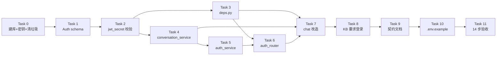

# P2 账号与鉴权 Implementation Plan

> **For Claude:** REQUIRED SUB-SKILL: Use superpowers:executing-plans to implement this plan task-by-task.

**Goal:** 让后端具备完整的账号体系 —— 用户可注册/登录拿 JWT，chat 三端点要求登录并做归属校验，KB 三端点要求登录，422 错误体符合契约。

**Architecture:** 分层沿用现状：`tools/`（security / http_tools / mysql_db_tools）→ `models.py`（ORM）→ `services/`（业务）→ `api/`（路由 + `deps.py` 依赖 + `errors.py` 异常翻译）。归属校验靠 `conversations(thread_id → user_id)` 这一张表；所有错误体统一为 `{"code","message"}`（`err()` 返回 / `api_error()` 抛出 / `errors.py` 翻译）。

**Tech Stack:** FastAPI + SQLAlchemy 2.0 async（aiomysql）+ PyJWT 2.13 + bcrypt 5.0 + pytest（全离线，SQLite 内存库替身）

**Spec:** `docs/superpowers/specs/2026-09-13-p2-account-auth-design.md`（注意 §7.9 是本 spec 的唯一权威口径）

---

## 前置：已经完成的部分（不要重做）

| 已完成 | 产物 | 证据 |
|---|---|---|
| B1 `users` 表对齐 §5 | `models.py`（`BIGINT UNSIGNED` / `password_hash VARCHAR(60)` / `created_at DATETIME(6)` / `uq_users_username` / `utf8mb4_0900_ai_ci`） | `tests/test_models.py` 11 用例 |
| B2 `Conversation` 模型 | 同上（含 `fk_conversations_user` CASCADE 与 DESC 索引） | 同上 |
| C1 统一异常处理器 | `backend/app/api/errors.py`（注册 Starlette `HTTPException` + `RequestValidationError`；保留 `exc.headers`；按状态码补 code） | `main.py:29` 已调 `register_error_handlers` |
| C2 去掉 `_api_error` 重复 | `security.py` 已无本地副本 | grep 0 命中 |
| 鉴权原语 | `backend/tools/security.py`（`hash_password` / `verify_password` / `create_access_token` / `decode_token`） | `tests/test_security.py` 21 用例 |
| 错误原语 | `backend/tools/http_tools.py`（`err` / `api_error`） | 全量 77 用例 |
| E3 lifespan 接线 | `main.py` 已 `await init_db()` / `await aclose_db()` / `await aclose_checkpointer()` | `main.py:13-20` |

**测试基线：`77 passed, 2 warnings`**（跑法见每个 Task 的验证步骤）。

---

## 执行状态（2026-09-17 更新：Task 0 执行后的实测校正）

| Task | 状态 |
|---|---|
| **0** | ✅ 完成（`1036ff3`；0.1 / 0.3 经核实不需要做） |
| **1** | ✅ 已完成 |
| **2** | ✅ 已完成 |
| **3** | ✅ 已完成（落在 `backend/app/api/deps.py`；空壳 `backend/tools/deps.py` 已删） |
| **4** | ✅ 已完成（`85894b8`） |
| **5** | ✅ 已完成（`78409ea` + 测试补齐，409 错误码已修） |
| **6** | ✅ 已完成（+ 测试补齐） |
| **7** | ✅ 已完成（+ 测试补齐；修掉 500、孤儿行、403 顺序三处缺陷） |
| **8** | ✅ 完成（`5f7a9b8`） |
| **9** | ✅ 完成（openapi.yaml 加 auth；README 新增「鉴权」章节） |
| **10** | ✅ 完成（`.env.example`） |
| **11** | ✅ 完成（§7.7 十四步 **14/14 通过**） |

**P2 全部完成。**

### Task 9 / 10 / 11 执行记录

**Task 9 契约文档**
- `openapi.yaml`：新增 `auth` tag 与三个 auth 端点、`bearerAuth` securityScheme、
  `AuthUser` / `RegisterRequest` / `LoginRequest` / `LoginResponse` 四个 schema、
  `Unauthorized` / `Forbidden` / `InvalidCredentials` / `UsernameTaken` 四个响应；
  chat / kb 共 6 个端点补 `security` 与 401/403；`ErrorEvent.code` 枚举 10 → 14。
  校验结果：9 个路径、24 个 `$ref` **零断链**、零未定义 scheme。
- `docs/api/README.md`：端点清单加「需登录」列 + 3 行 auth 端点；错误码表 10 → 14；
  新增「鉴权」章节（Bearer 用法、401/403 分工、归属规则、403 在流前、**KB 本期不隔离的已知缺口**）。
- ⚠ 我一度把 `RegisterRequest.password` 写成「schema 层刻意只卡 minLength」，并把
  `LoginRequest` 写成「不做 pattern/长度校验」—— 两处都与实现不符：`schemas.py:77-90`
  有 `@field_validator` 做 72 字节校验，且登录复用同一个 `Auth` 模型。已修正。
  教训：**契约描述要对着代码写，不能凭计划里的设计意图写**（计划写于校验器加入之前）。

**Task 10 `.env.example`**
- 放在仓库根 `advanced_tutorial/.env.example`（`.gitignore` 第 9 行有 `!.env.example` 白名单，
  实测 git 状态为 `??` 即可提交）。文件头写明「复制到上一级的 `.env`」，并解释为何 `.env`
  落在仓库外（`config.py` 读 `PROJECT_DIR.parent.parent/.env`）。
- 分三段：P2 必填（`RAGQA_JWT_SECRET` / `RAGQA_MYSQL_DATABASE_URL`）、P0/P1 既有、
  可选（LangSmith / OSS / MinerU）。每项都写了「为什么」而不只是「填什么」。

**Task 11 §7.7 手工验收：14/14 通过**（真实 MySQL / bcrypt / JWT / 真实图）

| # | 判据 | 结果 |
|---|---|---|
| 1 | 空密钥启动失败 | ✅ `ValidationError` 且提示含 `RAGQA_JWT_SECRET` |
| 2 | 注册 → 201；库里 `$2b$12$` 60 字符 | ✅ `{'id': 2, 'username': 'hao'}` |
| 3 | 重名 → 409 `USERNAME_TAKEN` | ✅ |
| 4 | 注册 `ab`/`x` → 422 契约格式 | ✅ message=`username: String should have at least 3 characters` |
| 5 | 73 字节密码 → 422 | ✅ message=`password: ... 不能超过 72 字节（当前 73 字节）` |
| 6 | 登录 → 200 + token | ✅ token 164 字符 |
| 7 | 错密码 → 401 `INVALID_CREDENTIALS` | ✅ |
| 8 | 无 token history → 401 | ✅ |
| 9 | 提问一次 → `conversations` 一行、title=首问前 20 字 | ✅ 真实图：`retrieve 命中 4 段` → `grade 4/4 相关` → SSE `step…done` |
| 10 | 他人 thread → 403 | ✅ |
| 11 | 从未用过的 uuid → 200 空数组 | ✅ |
| 12 | 无 token `/api/health` → 200 | ✅ `kb_count=3705` |
| 13 | 篡改 token → 401 | ✅ |
| 14 | `exp` 过期 → 401 | ✅ |

> 步骤 1 的测法踩了个 PowerShell 坑：`$env:RAGQA_JWT_SECRET=""` 是**删除**该变量而非设为空串，
> 于是 `.env` 的值照常生效、应用正常启动。改用空白串 `"   "` 才真正触发校验（也正好验证了
> 校验器里的 `.strip()`）。真正「完全没有该键」的场景由 `tests/test_config_jwt.py` 覆盖。

验收在真实库里留下：`users` 3 行（`61014` / `hao` / `hao2`）、`conversations` 1 行。

## 测试补齐与修复记录（2026-09-19）

补了三个原计划要求但缺失的测试文件，共 **30 例**（比计划的 25 例多 5 例护栏）：

| 文件 | 例数 | 新增的守护点 |
|---|---|---|
| `tests/test_auth_service.py` | 8（含 1 skip） | 409 必须是 `USERNAME_TAKEN`；两种登录失败文案逐字相同 |
| `tests/test_auth_endpoints.py` | 10 | 422 错误体形状；90 字节密码 422；过期 token 401 |
| `tests/test_chat_ownership.py` | 12 | 403 在流前抛出；未知 thread 返回 200 空数组；删除必须清索引行；403 不依赖 checkpointer 可读性 |

补齐后一次性暴露了 **5 个失败**，全部修掉：

| 失败用例 | 根因 | 修法 |
|---|---|---|
| `test_auth_service.py::..._raises_409_username_taken` | `auth_service.py:17` 抛 `BAD_REQUEST` | 改 `USERNAME_TAKEN` |
| `test_auth_endpoints.py::test_register_duplicate_409_contract_shape` | 同一根因 | 同上 |
| `test_chat_ownership.py::test_delete_own_thread_removes_conversation_row` | `delete_chat_thread` 未调 `delete_conversation_row` → 孤儿行 | 补调用 + `db.commit()` |
| `test_chat_stream.py::test_ungrounded_answer_is_persisted_in_history` | `get_chat_history` 改签名后该用例仍传 1 个参数 | 加 SQLite session fixture，按新签名调用 |
| `test_chat_stream.py::test_grounded_answer_is_persisted_as_true` | 同上 | 同上 |

另修掉一处**顺序缺陷**：`get_chat_history` 原先 `graph.aget_state(config)` 排在 `assert_owner` **之前**，导致「读 checkpoint 失败」会抛出 500 而非 403，攻击者可借状态码差异判断 thread_id 是否存在。已把 `assert_owner` 提到最前，并用 `test_history_403_does_not_depend_on_checkpointer_readability` 钉住（该用例先 RED 为 `assert 500 == 403`，再转绿）。

**最终状态：`131 passed, 1 skipped`**（补测试前 `102 passed`）。

> 两个反复出现的教训，值得记进开发约定：
> 1. **service 层用例与 HTTP 层契约脱节**：`get_chat_history` 的签名错配两次都没被察觉，因为既有用例直连 service、签名自洽。凡是「路由 → service」有参数契约的地方，必须有**走 HTTP 路由**的用例。
> 2. **改了 service 签名，必须全项目 grep 调用点**：本次签名变更直接打挂了 `test_chat_stream.py` 两个既有用例。

### Task 0 的实测偏差

- **0.1 建库不需要**：`rag_qa` 已存在，字符集/排序规则为 `utf8mb4` / `utf8mb4_0900_ai_ci`（正是 spec §5 要求），且 `users` / `conversations` 两张表已由 `init_db()` 建好，DDL 与 §5 逐字吻合
- **0.2 是修故障，不是补配置**：`.env` 里 `RAGQA_JWT_SECRET` 原为 **6 字节占位值**，撞上 Task 2 已加入的 `_require_jwt_secret`（要求 ≥32 字节），导致 `import config` 直接抛 `ValidationError` —— **应用与全部测试都跑不起来**。已替换为 64 字符随机值（该键仍只有 1 行）
- **0.3 依赖已声明**：`pyproject.toml:9` 有 `bcrypt>=5.0.0`、`:31` 有 `pyjwt>=2.13.0`，无需 `uv add`
- **0.4 / 0.5 / 0.6 完成**：auth 三端点返回契约格式 `501 {"code":"NOT_IMPLEMENTED","message":...}`（证明 `errors.py` 翻译链通）；openapi 挂载 9 个端点；`TestClient` 的 lifespan 启动+收尾均无异常

### ⚠️ 提交方式必须改（影响本计划每一个 Task）

`git status` 显示索引中**已预置暂存 9 个文件**：`errors.py`、`auth_service.py`、`deps.py`、`mysql_db_tools.py`、`security.py`、`upload_function_tools.py`（重命名）、`test_auth_schemas.py`、`test_config_jwt.py`。

**后果：本计划各 Task 末尾的裸 `git commit` 会把这批文件一起带走，可能还把 `data/checkpoints.db` 一并入库。** 全部改用 pathspec 形式：

```bash
git commit -m "..." -- <path1> <path2>
```

`git commit -- <path>` 只提交指定路径的**工作区**内容，忽略索引里其余暂存项。Task 0 以此提交 `1036ff3`，实测 `2 files changed`，预置的 8 个暂存项原样保留。

### Task 1 / Task 3 均已解决

`test_password_over_72_utf8_bytes_is_rejected_at_schema_layer` 已不再红灯。`backend/app/api/deps.py` 就是 Task 3 的目标位置，早先那个空壳 `backend/tools/deps.py` 已删除。

### ⚠️ Task 5 遗留：注册重名的错误码与契约不符（尚未修）

`auth_service.py:17` 抛的是 `api_error(409, "BAD_REQUEST", ...)`，而契约要求 `USERNAME_TAKEN`。四处互相矛盾：

- spec §6.4 错误码表、§7.7 手工验收第 3 步
- 本计划 Task 5 的实现片段（写的就是 `USERNAME_TAKEN`）
- `auth_router.py:20` 的 docstring：「重名 → 409 USERNAME_TAKEN」
- `models.py:42` 的注释：「P2 契约要求『用户名已存在 → 409 USERNAME_TAKEN』」

**全项目源码里 `USERNAME_TAKEN` 一处都不存在**，只出现在 spec / 计划 / 注释中。后果：§7.7 第 3 步会拿到 `{"code":"BAD_REQUEST"}`；前端若按 `USERNAME_TAKEN` 分支渲染注册错误行（spec §8 的映射表就是这么写的），那一支永远走不到。

修法：`auth_service.py:17` 改为 `api_error(409, "USERNAME_TAKEN", ...)`，并补 `tests/test_auth_service.py`（Task 5 的用例清单里有它，但该文件尚不存在，也是这条偏差没被拦住的原因）。

### Task 8 执行记录（`5f7a9b8`，4 files changed）

计划 Step 8.2–8.4 之外多了两处改动，都是**解阻断**性质，不是扩大范围：

1. **`kb_router.py:18` 的坏导入**（`from services import ...`）会让 `tests/test_kb_upload.py:35` 收集期就 `ModuleNotFoundError`，连续两轮 `Interrupted: 1 error during collection` —— **整个套件都跑不起来**。此项已由你自行改成 `backend.app.services`。
2. **`auth_service.py:1` 的 `from agent.schemas import AuthUser`**（错误导入根，且与第 6 行重复）会阻断 `main → auth_router → auth_service` 整条链，使 `test_health_stays_public` 无法导入 app。已删该行（顺带让模块 docstring 回到文件首行）。

**计划缺口（已补进 Task 8）**：原计划没写「新增鉴权门会让既有 `test_kb_upload.py` 的用例转红」，实际红了 **8 个**。修法是给它的 `client` fixture 整体挂上 token：

```python
c = TestClient(app)
c.headers.update({"Authorization": f"Bearer {sec.create_access_token(1, 'kb_tester')}"})
```

这样该文件继续聚焦契约本身，鉴权门由 `test_kb_requires_login.py` 单独守，职责不重叠。

**提交时的新注意点（Task 0 那条的补充）**：未跟踪文件**必须先 `git add`**，否则 `git commit -- <path>` 直接报 `did not match any file(s) known to git`（本次撞上过一次，好在提交未发生、无部分提交）。

---

## Task 0: 恢复可启动基线

**Files:**
- Modify: `rag_qa_project/backend/app/api/auth_router.py`
- Modify: `rag_qa_project/backend/app/api/main.py`
- Create: `my_langchain_demo/.env`（追加一行，注意 `rag_qa_project/` 的**上一级**）

### Step 0.1: 建库（否则 `init_db()` 让进程起不来）

Run:
```powershell
mysql -u root -p -e "CREATE DATABASE IF NOT EXISTS rag_qa CHARACTER SET utf8mb4 COLLATE utf8mb4_0900_ai_ci;"
```
Expected: 无输出即成功。验证：
```powershell
mysql -u root -p -e "SHOW CREATE DATABASE rag_qa;"
```
Expected: 输出含 `utf8mb4_0900_ai_ci`。

> 排序规则必须是 `_0900_ai_ci`（**大小写不敏感**）—— spec §5 明确 `Alice` 与 `alice` 撞唯一键是想要的行为。

### Step 0.2: `.env` 加 JWT 密钥

Run（PowerShell，注意是**上一级目录**的 `.env`）：
```powershell
cd "d:\PycharmProjects\my_langchain_demo"
$secret = & "d:\PycharmProjects\my_langchain_demo\.venv\Scripts\python.exe" -c "import secrets; print(secrets.token_hex(32))"
Add-Content -Path ".env" -Value "`nRAGQA_JWT_SECRET=$secret" -Encoding utf8
(Select-String -Path ".env" -Pattern "RAGQA_JWT_SECRET" -SimpleMatch).Count
```
Expected: 输出 `1`。

> 64 个十六进制字符 = 64 字节 ≥ PyJWT 对 HS256 的 32 字节最小长度要求（RFC 7518 §3.2），不会触发 `InsecureKeyLengthWarning`。

### Step 0.3: 显式声明传递依赖

Run:
```powershell
cd "d:\PycharmProjects\my_langchain_demo"; uv add pyjwt bcrypt
```
Expected: `pyproject.toml` 的 `dependencies` 多出 `pyjwt`、`bcrypt` 两行。

> 二者目前在 lock 里只是**传递依赖**（`pyjwt` 来自 `mcp`），显式声明后才不会因上游改动而消失。

### Step 0.4: 清 `auth_router.py` 的垃圾 import 与空壳端点

当前 `auth_router.py` 有三个问题：`from sys import prefix` 是无用导入；三个端点全是 `pass`（返回 `null`）；而且 `main.py` 已经把它挂上了，所以 `/api/auth/*` 现在返回 200 + `null`，比 404 更误导。

改为（Task 6 会填真实实现，这里先让它**诚实报未实现**，避免"看起来能调"）：

```python
# rag_qa_project/backend/app/api/auth_router.py
from fastapi import APIRouter

from backend.app.agent.schemas import Auth
from backend.tools.http_tools import api_error

router = APIRouter(prefix="/api/auth", tags=["auth"])


@router.post("/register")
async def register(auth: Auth):
    api_error(501, "NOT_IMPLEMENTED", "注册待实现（Task 6）")


@router.post("/login")
async def login(auth: Auth):
    api_error(501, "NOT_IMPLEMENTED", "登录待实现（Task 6）")


@router.get("/me")
async def me():
    api_error(501, "NOT_IMPLEMENTED", "me 待实现（Task 6）")
```

### Step 0.5: 清 `main.py` 的重复 import 与中段 import

`main.py:11` 与 `main.py:47` 重复 import 了 `chat_router, kb_router`，且第 47 行在文件中部（PEP 8）。删掉第 47 行，只保留顶部第 11 行。

### Step 0.6: 验证基线

Run:
```powershell
cd "d:\PycharmProjects\my_langchain_demo\advanced_tutorial\rag_qa_project"; & "d:\PycharmProjects\my_langchain_demo\.venv\Scripts\python.exe" -m pytest tests -q --no-header
```
Expected: `77 passed, 2 warnings`

Run（验证导入链与 lifespan 能起来）：
```powershell
& "d:\PycharmProjects\my_langchain_demo\.venv\Scripts\python.exe" -c "from backend.app.api.main import app; print('routes:', sorted(r.path for r in app.routes if hasattr(r,'path')))"
```
Expected: 输出含 `/api/auth/register` `/api/auth/login` `/api/auth/me`。

### Step 0.7: Commit

```powershell
cd "d:\PycharmProjects\my_langchain_demo\advanced_tutorial"
git add rag_qa_project/backend/app/api/auth_router.py rag_qa_project/backend/app/api/main.py
git commit -m "chore(p2): 清 auth_router 无用导入与空壳端点，去 main.py 重复 import"
```

---

## Task 1: 修正 `Auth` schema 并补齐鉴权响应模型

**Files:**
- Modify: `rag_qa_project/backend/app/agent/schemas.py:71-76`
- Test: `rag_qa_project/tests/test_auth_schemas.py`（新建）

**为什么必须改**：spec §6.2 要求 `username` 为 **3–32 位**，而当前 `Auth` 是 `min_length=1`。spec §7.7 验收第 4 步明确「注册 `ab` / `x` → `422`」—— 用 `min_length=1` 时 `ab` 会**通过校验**，验收直接失败。另外 `password` 的 `max_length=72` 是**字符数**，而 bcrypt 的硬上限是 **UTF-8 字节数**（30 个汉字 = 90 字节），两层规则不一致容易误导。

### Step 1.1: 写失败测试

```python
# rag_qa_project/tests/test_auth_schemas.py
# -*- coding: utf-8 -*-
"""鉴权请求/响应模型的契约校验（纯 pydantic，零依赖）。

守 spec §6.2 的字段约束 + §7.7 验收第 4 步（注册 `ab` 必须 422）。
"""
import sys
from pathlib import Path

import pytest
from pydantic import ValidationError

sys.path.insert(0, str(Path(__file__).resolve().parents[1]))

from backend.app.agent.schemas import Auth, AuthUser, LoginResponse


def test_username_min_length_is_3():
    """★ spec §6.2：username 是 3–32 位；§7.7 第 4 步要求 `ab` 被拒。"""
    with pytest.raises(ValidationError):
        Auth(username="ab", password="abcd1234")


def test_username_max_length_is_32():
    with pytest.raises(ValidationError):
        Auth(username="a" * 33, password="abcd1234")


def test_username_rejects_non_alnum_underscore():
    for bad in ("hao-1", "hao.1", "hao 1", "中文名"):
        with pytest.raises(ValidationError):
            Auth(username=bad, password="abcd1234")


def test_username_accepts_alnum_and_underscore():
    for good in ("hao", "hao_1", "ABC123", "a" * 32):
        assert Auth(username=good, password="abcd1234").username == good


def test_password_min_length_is_8():
    with pytest.raises(ValidationError):
        Auth(username="hao", password="a" * 7)


def test_password_over_72_utf8_bytes_is_rejected_at_schema_layer():
    """★ 30 个汉字 = 90 字节 > 72 —— 必须在 schema 层就拒掉。

    只写 max_length=72（字符数）会放过它，一路走到 bcrypt.hashpw 才 422，
    错误信息变成"密码不能超过 72 字节（当前 90 字节）"而不是契约里的字段级校验错。
    """
    han = "汉" * 30
    assert len(han) == 30 and len(han.encode("utf-8")) == 90

    with pytest.raises(ValidationError):
        Auth(username="hao", password=han)


def test_password_exactly_72_bytes_is_accepted():
    assert Auth(username="hao", password="a" * 72)


def test_auth_user_shape():
    au = AuthUser(id=1, username="hao")
    assert au.model_dump() == {"id": 1, "username": "hao"}


def test_login_response_shape():
    r = LoginResponse(access_token="t", user=AuthUser(id=1, username="hao"))
    assert r.model_dump() == {
        "access_token": "t", "token_type": "bearer",
        "user": {"id": 1, "username": "hao"}}
```

### Step 1.2: 运行确认失败

Run:
```powershell
cd "d:\PycharmProjects\my_langchain_demo\advanced_tutorial\rag_qa_project"; & "d:\PycharmProjects\my_langchain_demo\.venv\Scripts\python.exe" -m pytest tests/test_auth_schemas.py -v --no-header
```
Expected: FAIL —— `ImportError: cannot import name 'AuthUser'`（`Auth` 的断言也会先失败）

### Step 1.3: 实现

替换 `schemas.py:71-76` 的 `Auth`，并追加两个响应模型：

```python
class Auth(BaseModel):
    """注册 / 登录请求体（契约 components.schemas.RegisterRequest 与 LoginRequest 同形）。"""
    username: str = Field(
        description="用户名", min_length=3, max_length=32, pattern="^[A-Za-z0-9_]+$")
    password: str = Field(description="密码", min_length=8)


class AuthUser(BaseModel):
    """鉴权响应里的用户信息（契约 components.schemas.AuthUser）。"""
    id: int = Field(description="用户 ID")
    username: str = Field(description="用户名")


class LoginResponse(BaseModel):
    """登录成功响应（契约 components.schemas.LoginResponse）。"""
    access_token: str = Field(description="JWT")
    token_type: str = Field(default="bearer", description="固定 bearer（OAuth2 惯例）")
    user: AuthUser = Field(description="登录用户")
```

**注意 password 去掉了 `max_length`**：72 字节的上限交给 `security.hash_password` 判（那里有 `BCRYPT_MAX_BYTES`）。这样规则**只有一处真相源**，不会出现"字符数"和"字节数"两套标准漂移。

### Step 1.4: 运行确认通过

Run: 同 Step 1.2
Expected: `9 passed`

### Step 1.5: 全量回归

Run:
```powershell
& "d:\PycharmProjects\my_langchain_demo\.venv\Scripts\python.exe" -m pytest tests -q --no-header
```
Expected: `86 passed, 2 warnings`

### Step 1.6: Commit

```powershell
cd "d:\PycharmProjects\my_langchain_demo\advanced_tutorial"
git add rag_qa_project/backend/app/agent/schemas.py rag_qa_project/tests/test_auth_schemas.py
git commit -m "fix(p2): Auth.username 收紧为 3-32 位（§6.2），补 AuthUser/LoginResponse"
```

---

## Task 2: `config.py` 补 `jwt_secret` 启动期校验

**Files:**
- Modify: `rag_qa_project/config.py:68-71`
- Test: `rag_qa_project/tests/test_config_jwt.py`（新建）

**为什么**：spec §7.2 要求「`jwt_secret` 为空必须**启动失败**，不能退化成默认值——否则任何人都能伪造 token」。当前 `security._jwt_secret()` 只保证「用到即失败」，也就是**第一个登录请求才 500**；正确行为是 uvicorn **起不来**。

### Step 2.1: 写失败测试

```python
# rag_qa_project/tests/test_config_jwt.py
# -*- coding: utf-8 -*-
"""jwt_secret 的启动期校验：为空必须当场失败，绝不退化成空串签发。"""
import sys
from pathlib import Path

import pytest
from pydantic import ValidationError

sys.path.insert(0, str(Path(__file__).resolve().parents[1]))

from config import Settings


def test_empty_jwt_secret_is_rejected_at_construction():
    """★ §7.2：空密钥必须让「构造 Settings」这一步就失败（= uvicorn 起不来）。"""
    with pytest.raises(ValidationError) as ei:
        Settings(jwt_secret="")
    assert "RAGQA_JWT_SECRET" in str(ei.value)


def test_whitespace_jwt_secret_is_rejected():
    """`.env` 里写了 KEY= 却漏填是常见手误，纯空白同样算未配置。"""
    with pytest.raises(ValidationError):
        Settings(jwt_secret="   ")


def test_short_jwt_secret_is_rejected():
    """HS256 的密钥不足 32 字节会被 PyJWT 警告（RFC 7518 §3.2），提前拦掉。"""
    with pytest.raises(ValidationError) as ei:
        Settings(jwt_secret="short")
    assert "32" in str(ei.value)


def test_valid_jwt_secret_passes():
    s = Settings(jwt_secret="a" * 64)
    assert s.jwt_secret == "a" * 64
```

### Step 2.2: 运行确认失败

Run:
```powershell
cd "d:\PycharmProjects\my_langchain_demo\advanced_tutorial\rag_qa_project"; & "d:\PycharmProjects\my_langchain_demo\.venv\Scripts\python.exe" -m pytest tests/test_config_jwt.py -v --no-header
```
Expected: FAIL —— 前三个用例都不抛 `ValidationError`（当前无校验）

### Step 2.3: 实现

在 `config.py` 顶部补 `from pydantic import model_validator, ValidationError` 之类所需导入，并在 `Settings` 类内「---- 鉴权 ----」段之后加：

```python
    @model_validator(mode="after")
    def _require_jwt_secret(self):
        """§7.2：为空必须启动失败 —— 退化成空串等于任何人都能伪造 token。"""
        secret = (self.jwt_secret or "").strip()
        if not secret:
            raise ValueError(
                "RAGQA_JWT_SECRET 未设置。请在仓库根的 .env（rag_qa_project 的上一级）里加一行 "
                "RAGQA_JWT_SECRET=<openssl rand -hex 32 的输出>")
        if len(secret.encode("utf-8")) < 32:
            # HS256 的 HMAC 密钥要 ≥ 32 字节，否则 PyJWT 会在每次 encode/decode
            # 发 InsecureKeyLengthWarning（RFC 7518 §3.2）。在启动期拦掉更省事。
            raise ValueError(
                "RAGQA_JWT_SECRET 太短：HS256 要求 ≥ 32 字节（RFC 7518 §3.2）。"
                "请用 openssl rand -hex 32 生成（64 个字符）")
        return self
```

> ⚠ `Settings()` 在模块底部**立即实例化**（`config.py` 最后一行 `settings = Settings()`），所以校验会在任何 import 时生效 —— 这正是「启动即失败」想要的。

### Step 2.4: 运行确认通过

Run: 同 Step 2.2
Expected: `4 passed`

### Step 2.5: 验证真实的启动失败行为

Run（临时清掉密钥，应看到明确报错而非静默启动）：
```powershell
$env:RAGQA_JWT_SECRET=""; & "d:\PycharmProjects\my_langchain_demo\.venv\Scripts\python.exe" -c "import config"
```
Expected: 抛错且信息含 `RAGQA_JWT_SECRET`（不是默认值静默通过）。

### Step 2.6: 全量回归 + Commit

Run:
```powershell
& "d:\PycharmProjects\my_langchain_demo\.venv\Scripts\python.exe" -m pytest tests -q --no-header
```
Expected: `90 passed, 2 warnings`

```powershell
cd "d:\PycharmProjects\my_langchain_demo\advanced_tutorial"
git add rag_qa_project/config.py rag_qa_project/tests/test_config_jwt.py
git commit -m "feat(p2): jwt_secret 启动期校验（为空/过短即失败）"
```

---

## Task 3: `deps.py` —— 从请求头取当前用户

**Files:**
- Create: `rag_qa_project/backend/app/api/deps.py`
- Test: `rag_qa_project/tests/test_deps.py`（新建）

**为什么写成 `HTTPBearer(auto_error=False)`**：`auto_error=True`（默认）会自己抛 403 且响应体是 `{"detail":...}`，与契约的 `{code,message}` 冲突（spec §7.4 item 1）。

### Step 3.1: 写失败测试

```python
# rag_qa_project/tests/test_deps.py
# -*- coding: utf-8 -*-
"""get_current_user 依赖：正常路径 + 三种失败路径都必须回契约格式错误。"""
import sys
from pathlib import Path

import pytest
from fastapi import Depends, FastAPI
from fastapi.testclient import TestClient

sys.path.insert(0, str(Path(__file__).resolve().parents[1]))

from config import settings
from backend.app.api.deps import get_current_user
from backend.app.api.errors import register_error_handlers
from backend.app.agent.schemas import AuthUser
from backend.tools import security as sec


@pytest.fixture
def client(monkeypatch):
    """只挂一个探针端点，不 import 真实的 main（避免拉起 chroma/LLM 导入链）。"""
    monkeypatch.setattr(settings, "jwt_secret", "unit-test-secret-" + "0" * 26)
    app = FastAPI()
    register_error_handlers(app)

    @app.get("/probe")
    async def probe(user: AuthUser = Depends(get_current_user)):
        return {"id": user.id, "username": user.username}

    return TestClient(app)


def test_valid_token_returns_user(client):
    token = sec.create_access_token(7, "hao")
    r = client.get("/probe", headers={"Authorization": f"Bearer {token}"})

    assert r.status_code == 200
    assert r.json() == {"id": 7, "username": "hao"}


def test_missing_header_gives_401_contract_body(client):
    """★ 契约：401 且响应体是 {"code","message"}，不是 FastAPI 默认的 {"detail"}。"""
    r = client.get("/probe")

    assert r.status_code == 401
    assert set(r.json()) == {"code", "message"}
    assert r.json()["code"] == "UNAUTHORIZED"


def test_wrong_scheme_gives_401(client):
    """`Basic xxx` 不是 Bearer，必须拒。"""
    r = client.get("/probe", headers={"Authorization": "Basic aGFvOmhhbw=="})
    assert r.status_code == 401
    assert r.json()["code"] == "UNAUTHORIZED"


def test_tampered_token_gives_401(client):
    token = sec.create_access_token(1, "hao")
    head, payload, sig = token.split(".")
    bad = f"{head}.{payload}.{'A' if sig[-1] != 'A' else 'B'}{sig[1:]}"

    r = client.get("/probe", headers={"Authorization": f"Bearer {bad}"})

    assert r.status_code == 401
    assert r.json()["code"] == "UNAUTHORIZED"


def test_sub_must_be_int_like(client):
    """token 的 sub 是字符串（RFC 7519），依赖要把它还原成 int 主键。"""
    token = sec.create_access_token(42, "hao")
    r = client.get("/probe", headers={"Authorization": f"Bearer {token}"})
    assert r.json()["id"] == 42
```

### Step 3.2: 运行确认失败

Run:
```powershell
cd "d:\PycharmProjects\my_langchain_demo\advanced_tutorial\rag_qa_project"; & "d:\PycharmProjects\my_langchain_demo\.venv\Scripts\python.exe" -m pytest tests/test_deps.py -v --no-header
```
Expected: FAIL —— `ModuleNotFoundError: No module named 'backend.app.api.deps'`

### Step 3.3: 实现

```python
# rag_qa_project/backend/app/api/deps.py
"""鉴权依赖：从 Authorization 头解出当前用户。

`HTTPBearer(auto_error=False)` 是刻意的（spec §7.4 item 1）：默认 auto_error=True 会
自己抛 403 且响应体是 {"detail": ...}，与契约的 {code,message} 冲突。
这里自己判断 creds is None，走统一的 api_error。
"""
from typing import Annotated

from fastapi import Depends
from fastapi.security import HTTPAuthorizationCredentials, HTTPBearer

from backend.app.agent.schemas import AuthUser
from backend.tools.http_tools import api_error
from backend.tools.security import decode_token

# auto_error=False：缺头/格式错时返回 None 而不是自己抛 403+{"detail"}
_bearer = HTTPBearer(auto_error=False)


async def get_current_user(
    creds: Annotated[HTTPAuthorizationCredentials | None, Depends(_bearer)],
) -> AuthUser:
    """解析 Bearer token → AuthUser。

    失败一律 401 UNAUTHORIZED（decode_token 内部的过期/篡改/垃圾串都归这一句），
    文案不区分具体原因 —— 对客户端都是"重新登录"。
    """
    if creds is None or (creds.scheme or "").lower() != "bearer":
        api_error(401, "UNAUTHORIZED", "缺少或无效的 Authorization 头")

    payload = decode_token(creds.credentials)
    try:
        user_id = int(payload["sub"])
    except (KeyError, TypeError, ValueError):
        # decode_token 已用 options={"require": ["exp","sub"]} 保证 sub 存在，
        # 但 sub 不一定是数字（token 可能由别的服务签发）—— 同样归 401。
        api_error(401, "UNAUTHORIZED", "token 无效或已过期")
    return AuthUser(id=user_id, username=payload.get("username", ""))
```

### Step 3.4: 运行确认通过

Run: 同 Step 3.2
Expected: `5 passed`

### Step 3.5: Commit

```powershell
cd "d:\PycharmProjects\my_langchain_demo\advanced_tutorial"
git add rag_qa_project/backend/app/api/deps.py rag_qa_project/tests/test_deps.py
git commit -m "feat(p2): get_current_user 依赖（HTTPBearer(auto_error=False) + 契约格式 401）"
```

---

## Task 4: `conversation_service.py` —— 归属校验的唯一依据

**Files:**
- Create: `rag_qa_project/backend/app/services/conversation_service.py`
- Test: `rag_qa_project/tests/test_conversation_service.py`（新建）

**为什么这张表是 P2 的地基**：`thread_id` 由前端生成后直接进 checkpointer，**无处记录归属**。没有 `conversations` 表，P2 的 403 无从判断（spec §3 决策 5）。

### Step 4.1: 写失败测试

测试用 SQLite 文件库（不是内存库），因为要跨 session 验证 upsert。

```python
# rag_qa_project/tests/test_conversation_service.py
# -*- coding: utf-8 -*-
"""会话归属服务：upsert / assert_owner / 删除索引行。全离线（SQLite 替身）。"""
import asyncio
import sys
from pathlib import Path

import pytest
from sqlalchemy.ext.asyncio import async_sessionmaker, create_async_engine
from sqlalchemy.pool import StaticPool

sys.path.insert(0, str(Path(__file__).resolve().parents[1]))

from backend.app.models import Base
from backend.app.services import conversation_service as cs


@pytest.fixture
def sessionmaker_():
    engine = create_async_engine(
        "sqlite+aiosqlite:///:memory:", poolclass=StaticPool,
        connect_args={"check_same_thread": False})

    async def _setup():
        async with engine.begin() as conn:
            await conn.run_sync(Base.metadata.create_all)
    asyncio.run(_setup())

    maker = async_sessionmaker(engine, expire_on_commit=False)
    yield maker
    asyncio.run(engine.dispose())


def _run(maker, coro_factory):
    async def go():
        async with maker() as db:
            return await coro_factory(db)
    return asyncio.run(go())


def test_upsert_inserts_new_row_with_title_from_first_question(sessionmaker_):
    async def go(db):
        await cs.upsert_conversation(db, thread_id="t1", user_id=1,
                                     question="年假有几天？" * 5)
        await db.commit()
        return await db.get(conversation_service_model(), "t1")
    row = _run(sessionmaker_, go)

    assert row.user_id == 1
    assert row.title == ("年假有几天？" * 5)[:20], "title = 首问前 20 字（§3 决策 6）"
```

> ⚠ 上面最后两行的 `conversation_service_model()` 是占位写法，实际请用 `from backend.app.models import Conversation` 然后 `db.get(Conversation, "t1")`。

其余用例（同一文件，写法同上）：

1. `test_upsert_twice_keeps_first_title_and_updates_updated_at` —— 第二次提问**不改 title**、`updated_at` 变大（§6.3）
2. `test_assert_owner_passes_for_missing_row` —— **无行放行**（§7.5：新会话必须先能打开）
3. `test_assert_owner_passes_for_own_row`
4. `test_assert_owner_raises_403_for_other_user` —— `HTTPException` 403 + `{"code":"FORBIDDEN"}`
5. `test_delete_conversation_row_is_idempotent` —— 删不存在的行不报错

### Step 4.2: 运行确认失败

Run:
```powershell
cd "d:\PycharmProjects\my_langchain_demo\advanced_tutorial\rag_qa_project"; & "d:\PycharmProjects\my_langchain_demo\.venv\Scripts\python.exe" -m pytest tests/test_conversation_service.py -v --no-header
```
Expected: FAIL —— `ModuleNotFoundError: No module named 'backend.app.services.conversation_service'`

### Step 4.3: 实现

```python
# rag_qa_project/backend/app/services/conversation_service.py
"""会话归属：thread_id → user_id 的映射与校验。

这张表是 P2 归属校验的**唯一依据**（spec §3 决策 5）——thread_id 由前端生成，
checkpointer 里只有图状态、没有归属信息。
"""
from datetime import UTC, datetime

from sqlalchemy import select
from sqlalchemy.ext.asyncio import AsyncSession

from backend.app.models import Conversation
from backend.tools.http_tools import api_error

TITLE_MAX_CHARS = 20


async def upsert_conversation(db: AsyncSession, *, thread_id: str,
                              user_id: int, question: str) -> Conversation:
    """新行插入（title = 首问前 20 字）；已有行只更新 updated_at。

    title 只在首次提问时写（spec §3 决策 6）：P2 的 upsert 现场正好握着 question，
    留到 P3 再补就要回填历史行。
    """
    row = await db.get(Conversation, thread_id)
    now = datetime.now(UTC)
    if row is None:
        row = Conversation(thread_id=thread_id, user_id=user_id,
                           title=question[:TITLE_MAX_CHARS],
                           created_at=now, updated_at=now)
        db.add(row)
    else:
        row.updated_at = now
    await db.flush()
    return row


async def assert_owner(db: AsyncSession, thread_id: str, user_id: int) -> None:
    """无行 = 新会话（放行）；有行且不是本人 = 403。

    **无行必须放行**：前端 useThreadId 在本地生成 uuid 后立刻可能调 history
    （useChat.ts 的挂载逻辑），此时后端还没有这一行。若返回 403，新会话永远打不开。
    """
    row = await db.get(Conversation, thread_id)
    if row is not None and row.user_id != user_id:
        api_error(403, "FORBIDDEN", "该会话不属于当前用户")


async def delete_conversation_row(db: AsyncSession, thread_id: str) -> None:
    """删索引行。幂等：不存在也不报错（删除顺序见 spec §7.6 第 3 步）。"""
    row = await db.get(Conversation, thread_id)
    if row is not None:
        await db.delete(row)
```

### Step 4.4: 运行确认通过

Run: 同 Step 4.2
Expected: `5 passed`

### Step 4.5: Commit

```bash
cd "d:\PycharmProjects\my_langchain_demo\advanced_tutorial"
git add rag_qa_project/backend/app/services/conversation_service.py rag_qa_project/tests/test_conversation_service.py
git commit -m "feat(p2): conversation_service（upsert / assert_owner / delete_row）"
```

---

## Task 5: `auth_service.py` —— 注册与登录

**Files:**
- Modify: `rag_qa_project/backend/app/services/auth_service.py`（**当前是空文件**）
- Test: `rag_qa_project/tests/test_auth_service.py`（新建）

**两条契约要点**：注册时用户名已存在 → `409 USERNAME_TAKEN`；登录失败**不区分**「用户不存在」与「密码错」→ 统一 `401 INVALID_CREDENTIALS`（防用户名枚举，spec §6.4）。

### Step 5.1: 写失败测试

要点（写法同 Task 4 的 `sessionmaker_` fixture）：

1. `test_register_creates_user_with_hashed_password` —— 断言 `password_hash != 明文` 且以 `$2b$` 开头、长度 60
2. `test_register_duplicate_username_raises_409` —— 第二次注册 → `HTTPException` 409 / `USERNAME_TAKEN`
3. `test_register_duplicate_username_is_case_insensitive_on_mysql` —— **标记为 `@pytest.mark.skip(reason="需要 MySQL 的 ci 排序规则，SQLite 上不成立")`**，留给 §7.7 手工验收第 3 步
4. `test_login_returns_token_and_user`
5. `test_login_wrong_password_401_invalid_credentials`
6. `test_login_unknown_user_401_with_same_message` —— 两次响应的 `message` **完全一致**（不能泄露用户是否存在）
7. `test_login_token_contains_user_id`

### Step 5.2: 运行确认失败

Run:
```powershell
cd "d:\PycharmProjects\my_langchain_demo\advanced_tutorial\rag_qa_project"; & "d:\PycharmProjects\my_langchain_demo\.venv\Scripts\python.exe" -m pytest tests/test_auth_service.py -v --no-header
```
Expected: FAIL —— `ImportError: cannot import name 'register' from ...auth_service`（文件为空）

### Step 5.3: 实现

```python
# rag_qa_project/backend/app/services/auth_service.py
"""注册与登录的业务逻辑。密码哈希/JWT 签发复用 tools/security.py。"""
from sqlalchemy import select
from sqlalchemy.ext.asyncio import AsyncSession

from backend.app.agent.schemas import AuthUser, LoginResponse
from backend.app.models import User
from backend.tools.http_tools import api_error
from backend.tools.security import create_access_token, hash_password, verify_password

# 登录失败统一文案：故意不区分「用户不存在」与「密码错」，避免用户名枚举（spec §6.4）
_LOGIN_FAILED = "用户名或密码错误"


async def register(db: AsyncSession, *, username: str, password: str) -> AuthUser:
    """注册。用户名已存在 → 409 USERNAME_TAKEN。"""
    existing = await db.scalar(select(User.id).where(User.username == username))
    if existing is not None:
        api_error(409, "USERNAME_TAKEN", "用户名已存在")

    user = User(username=username, password_hash=hash_password(password))
    db.add(user)
    await db.commit()
    await db.refresh(user)
    return AuthUser(id=user.id, username=user.username)


async def login(db: AsyncSession, *, username: str, password: str) -> LoginResponse:
    """登录。失败一律 401 INVALID_CREDENTIALS（不区分原因）。"""
    user = await db.scalar(select(User).where(User.username == username))
    # 注意：verify_password 对脏哈希/超长口令都回 False，永不抛异常
    if user is None or not verify_password(password, user.password_hash):
        api_error(401, "INVALID_CREDENTIALS", _LOGIN_FAILED)

    return LoginResponse(
        access_token=create_access_token(user.id, user.username),
        user=AuthUser(id=user.id, username=user.username))
```

> ⚠ `hash_password` 对 >72 字节抛 422 `VALIDATION_ERROR`——这是契约要求的（§7.7 第 5 步），不要吞掉。

### Step 5.4: 运行确认通过

Run: 同 Step 5.2
Expected: `6 passed, 1 skipped`

### Step 5.5: Commit

```bash
cd "d:\PycharmProjects\my_langchain_demo\advanced_tutorial"
git add rag_qa_project/backend/app/services/auth_service.py rag_qa_project/tests/test_auth_service.py
git commit -m "feat(p2): auth_service 注册/登录（409 重名、401 不区分原因）"
```

---

## Task 6: `auth_router.py` 三端点接真实实现

**Files:**
- Modify: `rag_qa_project/backend/app/api/auth_router.py`
- Test: `rag_qa_project/tests/test_auth_endpoints.py`（新建）

**背景**：Task 0 先把三个端点改成诚实报 `501`，这里替换成真实实现。需要给 `app` 注入 SQLite 替身的 `get_db_session`。

### Step 6.1: 写失败测试

用 `FastAPI()` + `include_router(auth_router.router)` + `app.dependency_overrides[get_db_session]` 指向 SQLite 会话，避免拉起真实 main 的导入链。

用例（spec §7.8 的端点级要求）：

1. `test_register_201_returns_id_and_username`
2. `test_register_duplicate_409_contract_shape`
3. `test_register_short_username_422_contract_shape` —— **★ 断言错误体是 `{code,message}` 而非 `{detail:[...]}`**（这是本期修掉的既有契约违背）
4. `test_register_password_over_72_bytes_422`
5. `test_login_200_returns_token_and_user`
6. `test_login_wrong_password_401_contract_shape`
7. `test_me_without_token_401`
8. `test_me_with_token_200`
9. `test_me_with_expired_token_401`

### Step 6.2: 运行确认失败

Run:
```powershell
cd "d:\PycharmProjects\my_langchain_demo\advanced_tutorial\rag_qa_project"; & "d:\PycharmProjects\my_langchain_demo\.venv\Scripts\python.exe" -m pytest tests/test_auth_endpoints.py -v --no-header
```
Expected: FAIL —— 全部 `501 NOT_IMPLEMENTED`

### Step 6.3: 实现

```python
# rag_qa_project/backend/app/api/auth_router.py
"""账号端点（契约 docs/api/README.md「鉴权」）。"""
from typing import Annotated

from fastapi import APIRouter, Depends
from sqlalchemy.ext.asyncio import AsyncSession

from backend.app.agent.schemas import Auth, AuthUser, LoginResponse
from backend.app.api.deps import get_current_user
from backend.app.services import auth_service
from backend.tools.mysql_db_tools import get_db_session

router = APIRouter(prefix="/api/auth", tags=["auth"])

DbSession = Annotated[AsyncSession, Depends(get_db_session)]


@router.post("/register", status_code=201, response_model=AuthUser)
async def register(auth: Auth, db: DbSession):
    """注册。重名 → 409 USERNAME_TAKEN；字段不合法 → 422（契约格式）。"""
    return await auth_service.register(db, username=auth.username, password=auth.password)


@router.post("/login", response_model=LoginResponse)
async def login(auth: Auth, db: DbSession):
    """登录。失败 → 401 INVALID_CREDENTIALS（不区分用户名/密码错）。"""
    return await auth_service.login(db, username=auth.username, password=auth.password)


@router.get("/me", response_model=AuthUser)
async def me(user: Annotated[AuthUser, Depends(get_current_user)]):
    """返回当前登录用户（token 由 get_current_user 校验）。"""
    return user
```

### Step 6.4: 运行确认通过

Run: 同 Step 6.2
Expected: `9 passed`

### Step 6.5: Commit

```bash
cd "d:\PycharmProjects\my_langchain_demo\advanced_tutorial"
git add rag_qa_project/backend/app/api/auth_router.py rag_qa_project/tests/test_auth_endpoints.py
git commit -m "feat(p2): auth 三端点（register/login/me）接真实实现"
```

---

## Task 7: chat 三端点改造为「要求登录 + 归属校验」

**Files:**
- Modify: `rag_qa_project/backend/app/api/chat_router.py`
- Modify: `rag_qa_project/backend/app/services/chat_service.py`（新增 `prepare_stream` + `delete_chat_thread` 加归属参数）
- Test: `rag_qa_project/tests/test_chat_ownership.py`（新建）

**关键约束**：`403` 必须在**返回 `StreamingResponse` 之前**抛出（§6.3）—— 响应头一旦发出就改不了状态码。所以要把「鉴权 + upsert」提到一个独立协程里，流生成器只是它的返回值。

**`/history` 的既有约定不能破**：无行 → `200 {"messages": []}`（前端新会话依赖它），有行但非本人 → `403`。

### Step 7.1: 写失败测试

要点：

1. `test_stream_without_token_401`
2. `test_stream_other_users_thread_403_before_stream` —— **★ 断言 `r.headers` 里没有 `text/event-stream`**，证明 403 发生在流开始前
3. `test_stream_creates_conversation_row_with_title` —— 首问前 20 字
4. `test_stream_second_question_keeps_title`
5. `test_history_without_token_401`
6. `test_history_of_other_users_thread_403`
7. `test_history_of_unknown_thread_returns_empty_200` —— ★ 守既有约定
8. `test_delete_without_token_401`
9. `test_delete_other_users_thread_403_and_keeps_data` —— ★ 403 时**不得**删任何东西

### Step 7.2: 运行确认失败

Run:
```powershell
cd "d:\PycharmProjects\my_langchain_demo\advanced_tutorial\rag_qa_project"; & "d:\PycharmProjects\my_langchain_demo\.venv\Scripts\python.exe" -m pytest tests/test_chat_ownership.py -v --no-header
```
Expected: FAIL —— 当前三端点都没有鉴权，无 token 也能 200

### Step 7.3: 实现 `chat_service` 新增 `prepare_stream`

在 `chat_service.py` 顶部补 `from sqlalchemy.ext.asyncio import AsyncSession`、`from backend.app.services import conversation_service`，并新增：

```python
async def prepare_stream(chat_request: ChatRequest, user_id: int,
                         db: AsyncSession):
    """鉴权 + upsert 完成后，把流生成器交给路由。

    必须与 stream_chat 分开：`403` 要在返回 StreamingResponse **之前**抛出，
    一旦响应头发出就只能降级成 SSE error 帧，前端得为同一端点写两套错误处理。

    返回的是异步生成器（不是协程），路由直接交给 StreamingResponse。
    """
    await conversation_service.assert_owner(db, chat_request.thread_id, user_id)
    await conversation_service.upsert_conversation(
        db, thread_id=chat_request.thread_id, user_id=user_id,
        question=chat_request.question)
    await db.commit()
    return stream_chat(chat_request)
```

`delete_chat_thread` 增加归属校验（在删除前）：

```python
async def delete_chat_thread(thread_id: str, user_id: int,
                             db: AsyncSession) -> ChatDeleteResponse:
    """删除会话。先鉴权（非本人 → 403），再删除（顺序见 spec §7.6）。"""
    await conversation_service.assert_owner(db, thread_id, user_id)
    checkpointer = get_graph().checkpointer
    ...  # 其余不变：alist 探测 + aclose + adelete_thread
    # 删掉索引行（§7.6 第 3 步：先删大头不可逆数据，再删索引行）
    await conversation_service.delete_conversation_row(db, thread_id)
    await db.commit()
    return ChatDeleteResponse(thread_id=thread_id, deleted=existed)
```

`get_chat_history` 同理加 `assert_owner`（**无法行则放行**，由 `assert_owner` 保证）。

### Step 7.4: 实现 `chat_router` 三端点

```python
# rag_qa_project/backend/app/api/chat_router.py
from typing import Annotated

from fastapi import APIRouter, Depends
from fastapi.responses import StreamingResponse
from sqlalchemy.ext.asyncio import AsyncSession

from backend.app.agent.schemas import AuthUser, ChatDeleteResponse, ChatRequest
from backend.app.api.deps import get_current_user
from backend.app.services import chat_service
from backend.tools.mysql_db_tools import get_db_session

router = APIRouter(prefix="/api/chat", tags=["chat"])

DbSession = Annotated[AsyncSession, Depends(get_db_session)]
CurrentUser = Annotated[AuthUser, Depends(get_current_user)]


@router.post("/stream")
async def stream_chat(chat_request: ChatRequest, user: CurrentUser, db: DbSession):
    """流式聊天（要求登录 + 归属校验）。

    403 由 prepare_stream 在返回 StreamingResponse 之前抛出。
    """
    agen = await chat_service.prepare_stream(chat_request, user.id, db)
    return StreamingResponse(
        agen, media_type="text/event-stream",
        headers={"Cache-Control": "no-cache", "Connection": "keep-alive",
                 "X-Accel-Buffering": "no"},   # 关代理缓冲，否则 token 被憋住
    )


@router.get("/history")
async def get_chat_history(thread_id: str, user: CurrentUser, db: DbSession):
    """聊天历史。无行 → 200 空数组（既有约定，前端新会话依赖它）；非本人 → 403。"""
    return await chat_service.get_chat_history(thread_id, user.id, db)


@router.delete("/threads/{thread_id}", response_model=ChatDeleteResponse)
async def delete_chat(thread_id: str, user: CurrentUser, db: DbSession):
    """删除一个会话在服务端的全部状态（checkpoints + writes + 索引行）。

    不可恢复；幂等：未知/已删过的 thread_id 返回 deleted=false（非 404）。
    thread_id 用 str 而非 UUID：与 /history 一致，契约也建议后端用 str。
    """
    return await chat_service.delete_chat_thread(thread_id, user.id, db)
```

### Step 7.5: 运行确认通过

Run: 同 Step 7.2
Expected: `9 passed`

### Step 7.6: 全量回归 + Commit

Run:
```powershell
& "d:\PycharmProjects\my_langchain_demo\.venv\Scripts\python.exe" -m pytest tests -q --no-header
```
Expected: 全绿（`tests/test_chat_stream.py` 的 7 个用例需要同步加 token 注入，见下）

> ⚠ **既有测试会红**：`tests/test_chat_stream.py` 现在直连 `chat_service.stream_chat`（不带鉴权），若它走的是 service 层则不受影响；但若经过路由，需要补 `dependency_overrides`。**这一步不可避免**，属于 spec §10 允许的「mock 工厂适配」。

```bash
cd "d:\PycharmProjects\my_langchain_demo\advanced_tutorial"
git add rag_qa_project/backend/app/api/chat_router.py rag_qa_project/backend/app/services/chat_service.py rag_qa_project/tests/test_chat_ownership.py
git commit -m "feat(p2): chat 三端点要求登录并做归属校验"
```

---

## Task 8: KB 三端点要求登录（不做归属隔离）

**Files:**
- Modify: `rag_qa_project/backend/app/api/kb_router.py`
- Test: `rag_qa_project/tests/test_kb_requires_login.py`（新建）

**本期只要求登录**（spec §3 决策 4）：metadata 不写 `user_id`，任何登录用户都能删任何上传件 —— 这是**已知越权**，用测试钉住，P3 再修。

### Step 8.1: 写失败测试

1. `test_upload_without_token_401`
2. `test_list_without_token_401`
3. `test_delete_without_token_401`
4. `test_kb_endpoints_require_login_but_not_ownership` —— ★ 用户 B 的 token 能删用户 A 上传的文档，**断言 200**（把已知行为钉住，防止误以为已修）
5. `test_health_stays_public` —— ★ `GET /api/health` 不带 token 仍 `200`

### Step 8.2-8.4: 实现

给三个端点加 `user: CurrentUser` 参数（仅声明、不使用，用 `_user` 命名并加注释说明本期不校验归属）。`/api/health` 在 `main.py`，**不加**依赖。

### Step 8.5: Commit

```bash
git add rag_qa_project/backend/app/api/kb_router.py rag_qa_project/tests/test_kb_requires_login.py
git commit -m "feat(p2): KB 三端点要求登录（本期不做归属隔离，用测试钉住已知越权）"
```

---

## Task 9: 契约文档同步

**Files:**
- Modify: `rag_qa_project/docs/api/openapi.yaml`
- Modify: `rag_qa_project/docs/api/README.md`

**现状**：`openapi.yaml` 里 `auth` 相关命中 **0** 处，完全未动。

### Step 9.1: `openapi.yaml`

按 spec §6.6 的表逐项改：

| 位置 | 改动 |
|---|---|
| `tags` | 新增 `- name: auth` |
| `paths` 开头 | 新增 `/api/auth/register`、`/api/auth/login`、`/api/auth/me` |
| chat 三端点 | 各加 `security: [{bearerAuth: []}]` 与 `401`/`403` 响应 |
| kb 三端点 | 各加 `security: [{bearerAuth: []}]` 与 `401` |
| `components.securitySchemes` | 新增 `bearerAuth`（`type: http, scheme: bearer, bearerFormat: JWT`） |
| `components.schemas` | 新增 `AuthUser` / `RegisterRequest` / `LoginRequest` / `LoginResponse` |
| `components.responses` | 新增 `Unauthorized` / `Forbidden` / `UsernameTaken` |
| `ErrorEvent.code` 枚举 | 追加 `UNAUTHORIZED` / `INVALID_CREDENTIALS` / `FORBIDDEN` / `USERNAME_TAKEN` |

### Step 9.2: `docs/api/README.md`

- 端点表新增 3 行 auth 端点；chat/kb 各行标注「需登录」
- 错误码表新增 4 行（`UNAUTHORIZED` 401 / `INVALID_CREDENTIALS` 401 / `FORBIDDEN` 403 / `USERNAME_TAKEN` 409）
- 新增「鉴权」章节：Bearer 用法、token 7 天有效期、401 与 403 的区别、`/api/health` 保持公开、**KB 本期不隔离的已知越权**

### Step 9.3: 验证 + Commit

Run（契约文件是 YAML，用 python 校验语法）：
```powershell
cd "d:\PycharmProjects\my_langchain_demo\advanced_tutorial\rag_qa_project"; & "d:\PycharmProjects\my_langchain_demo\.venv\Scripts\python.exe" -c "import yaml,pathlib; d=yaml.safe_load(pathlib.Path('docs/api/openapi.yaml').read_text(encoding='utf-8')); print('auth paths:', [p for p in d['paths'] if 'auth' in p]); print('schemes:', list(d['components']['securitySchemes']))"
```
Expected: `auth paths: ['/api/auth/register', '/api/auth/login', '/api/auth/me']` + `schemes: ['bearerAuth']`

```bash
git add rag_qa_project/docs/api/openapi.yaml rag_qa_project/docs/api/README.md
git commit -m "docs(p2): 契约补 auth 三端点、bearerAuth 与 4 个错误码"
```

---

## Task 10: `.env.example`

**Files:**
- Create: `my_langchain_demo/.env.example`（**位置待定，见下**）

**位置问题**：`.env` 实际在 `my_langchain_demo/`（git 仓库根 `advanced_tutorial/` 的**上一级**），而 `config.py` 用 `PROJECT_DIR.parent.parent / ".env"` 读它。模板若放进仓库内，`config.py` 读不到 —— 但因为**模板本来就不该被读取**（它只是给人看的参照），放进仓库更合理，且 `advanced_tutorial/.gitignore:10` 已有 `!.env.example` 白名单。

**决策：放 `advanced_tutorial/.env.example`**（仓库内、可提交），并在文件头注明「复制到上一级并改名为 `.env`」。

内容：

```
# 复制本文件到 ../../.env（即 my_langchain_demo/.env，rag_qa_project 的上一级）后填真实值。
# 该位置已被 .gitignore 覆盖，不会进版本库。

# ---- MySQL（P2 账号体系）----
RAGQA_MYSQL_DATABASE_URL=mysql+aiomysql://<user>:<pwd>@localhost:3306/rag_qa?charset=utf8mb4
# 口令含 @ : / # 等保留字符时必须 URL 编码（如 @ 写成 %40），或用 sqlalchemy.URL.create
RAGQA_SQL_ECHO=false

# ---- JWT（必填，为空则启动失败）----
# 用 openssl rand -hex 32 生成，不要用示例值
RAGQA_JWT_SECRET=

# ---- 既有（P0/P1）----
# DEEPSEEK_API_KEY / DASHSCOPE_API_KEY 等见 config.py 与 README「配置项」
```

### Commit

```bash
cd "d:\PycharmProjects\my_langchain_demo\advanced_tutorial"
git add .env.example
git commit -m "docs(p2): 新增 .env.example 模板"
```

---

## Task 11: 手工验收（spec §7.7 的 14 步）

**Files:** 无（纯验证）

Run（先确保 Task 0 的库与密钥就位）：
```powershell
cd "d:\PycharmProjects\my_langchain_demo\advanced_tutorial\rag_qa_project"
& "d:\PycharmProjects\my_langchain_demo\.venv\Scripts\python.exe" -m uvicorn backend.app.api.main:app --port 8000 --reload
```

逐条对照 spec §7.7：

| # | 步骤 | 预期 |
|---|---|---|
| 1 | 不设 `RAGQA_JWT_SECRET` 启动 | **启动失败**，报明确提示 |
| 2 | 注册 `hao` / `abcd1234` | `201 {id,username}`；MySQL 里 `password_hash` 以 `$2b$` 开头 |
| 3 | 用同名再注册 | `409 {"code":"USERNAME_TAKEN"}` |
| 4 | 注册 `ab` / `x` | `422 {"code":"VALIDATION_ERROR","message":"username: ..."}` |
| 5 | 注册 73 字节密码 | `422`，不是静默成功 |
| 6 | 登录正确密码 | `200`，拿到 `access_token` |
| 7 | 登录错误密码 | `401 INVALID_CREDENTIALS` |
| 8 | 不带 token 调 `history` | `401 UNAUTHORIZED` |
| 9 | 带 token 提问一次，查 MySQL | `conversations` 有一行，`title` = 首问前 20 字 |
| 10 | 第二个账号访问第一个账号的 thread | `403 FORBIDDEN` |
| 11 | 第二个账号访问**从未用过**的 uuid | `200 {"messages":[]}`（不是 403） |
| 12 | 不带 token 调 `/api/health` | `200`（保持公开） |
| 13 | 手改 token 一个字符 | `401 UNAUTHORIZED` |
| 14 | `exp` 改成过去时间 | `401 UNAUTHORIZED` |

直接查库对账（比看 API 更硬）：
```powershell
mysql -u root -p rag_qa -e "SELECT id,username,LEFT(password_hash,7) AS hash_prefix,LENGTH(password_hash) AS len,created_at FROM users; SELECT thread_id,user_id,title FROM conversations;"
```
Expected: `hash_prefix = $2b$12$`、`len = 60`、`conversations` 的 `user_id` 与提问账号一致。

### 最终全量回归

```powershell
cd "d:\PycharmProjects\my_langchain_demo\advanced_tutorial\rag_qa_project"; & "d:\PycharmProjects\my_langchain_demo\.venv\Scripts\python.exe" -m pytest tests -q --no-header
```
Expected: 全绿，且 `data/checkpoints.db` **不存在**（测试必须零污染真实库）。

---

## 依赖关系与建议执行顺序



**Task 3 与 Task 4 可并行**（互不依赖）；其余串行。

---

## 本计划的范围外（YAGNI / 另开计划）

| 项 | 说明 |
|---|---|
| **前端 H 组**（13 个文件） | `frontend/src` 当前**没有** `useAuth.ts` / `tokenStore.ts` / `LoginPage.tsx`，`openapi.yaml` 也无 auth。前端是独立工作量，建议单独出一份计划（spec §8 已写清设计与测试影响） |
| refresh token / logout 端点 | spec §2 非目标 |
| 登录限流 | spec §11 已知风险 |
| Alembic 迁移 | spec §13 技术债（改字段需手工 ALTER） |
| KB 归属隔离 | P3 |
| 会话列表 UI | P3 |

## 已知边界（写进 spec 的遗留）

1. **`conversations` 与 checkpointer 不在同一事务**：`DELETE` 失败时可能留下孤儿 checkpoint（只占空间，不影响正确性；spec §7.6 已记录该顺序的取舍）。
2. **`assert_owner` 的 TOCTOU 窗口**：探测与写入之间非原子。单用户场景无影响；严格化需要事务 + `SELECT ... FOR UPDATE`，属过度设计。
3. **`SqliteSaver` 单文件写锁**：`uvicorn --workers 2+` 会锁库。换 `PostgresSaver` 时因 `adelete_thread` 是 saver 通用接口，契约与前端零改动。
4. **`users` 的 `created_at` 无 server_default**：为与 §5 的 DDL 逐字一致而刻意留空，裸 SQL `INSERT` 必须自带该列（走 ORM 不受影响）。
