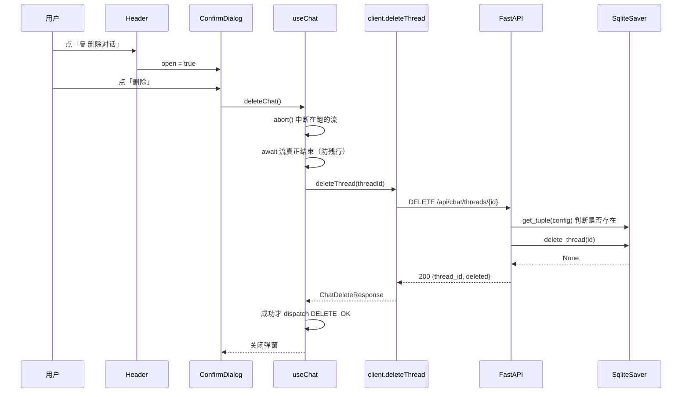

# 删除对话 + 会话持久化（P1）设计文档

- **日期**：2026-09-13
- **状态**：设计已确认，待实现
- **阶段**：P1（三阶段规划的第一阶段；P2 账号体系、P3 会话列表 + 知识库按用户隔离，均不在本 spec 范围）
- **分工**：后端由用户实现；接口契约与前端由 AI 产出
- **关联文档**：`2026-09-09-langchain-qa-web-design.md`（全栈骨架与聊天契约）、`2026-09-11-kb-upload-design.md`（知识库上传）
- **前置结论**：`langgraph-checkpoint 4.2.0` 的 `BaseCheckpointSaver` 声明 `delete_thread`/`adelete_thread`（`base/__init__.py:320,511`），`InMemorySaver` 已实现（`memory/__init__.py:505-521,602-611`）；官方文档 `data/langchain_docs/langgraph/add-memory.md:1691-1696` 将 `checkpointer.delete_thread(thread_id)` 列为通用接口

---

## 1. 背景与问题

| # | 现状 | 证据 |
|---|---|---|
| 1 | 会话状态存在 `InMemorySaver`，**后端重启即全部丢失** | `backend/app/agent/graph.py:222` `b.compile(checkpointer=InMemorySaver())`；`persistence.md:63-70` |
| 2 | 已有「＋ 新对话」按钮，但只换 uuid、**不清服务端** → 旧 thread 永久堆积在内存 | `frontend/src/components/Header.tsx:23-25`（按钮元素）、`frontend/src/hooks/useChat.ts:105-109`、`frontend/src/hooks/useThreadId.ts:24-29` |
| 3 | 后端只有 `POST /stream` + `GET /history`，**没有任何删除能力** | `backend/app/api/chat_router.py:10,21` |
| 4 | `GET /api/chat/history?thread_id=X` 无鉴权、无归属校验（P2 才解决，本期仅记录） | `backend/app/api/chat_router.py:21-24` |

**核心矛盾**：在内存态存储下做「删除对话」没有意义——重启本来就会清空。所以 P1 必须**同时**做持久化与删除，两件事互为前提。

## 2. 目标与非目标

### 目标
1. 会话历史**跨进程重启存活**（换 `SqliteSaver`）
2. 提供 `DELETE /api/chat/threads/{thread_id}`，真正删除服务端 thread 状态
3. 前端提供带二次确认的「删除对话」入口，删除成功后清空界面
4. 「新对话」与「删除对话」语义**正交**，用户能理解两者区别

### 非目标（YAGNI）
- 会话列表 / 侧栏 / 多会话切换（→ P3）
- 账号、鉴权、归属校验（→ P2）
- 删除单条消息（`RemoveMessage` + `update_state` 路径，本期不做）
- toast 通知系统（项目现无，错误就地展示）
- 批量删除 / 清空全部会话
- 知识库（KB）任何逻辑改动
- MySQL checkpointer（见 §3 决策 2）

## 3. 决策记录

| # | 决策 | 选择 | 被否决的方案与理由 |
|---|---|---|---|
| 1 | 功能范围 | **单会话删除** | ✗ 多会话侧栏：OSS LangGraph 不提供线程管理能力（`checkpointers.md:37` 明示创建/管理 thread 的端点属 LangSmith / Agent Server 平台层），`get_state_history` 只能查单个 thread（`checkpointers.md:160`），`checkpointer.list(None)` 返回的是 checkpoint 流而非会话列表；内存态下做出来的列表是假的<br>✗ 把「新对话」升级为「删除并新建」：用户失去「开新的但保留旧的」语义 |
| 2 | checkpointer | **`SqliteSaver`（同步，官方）** | ✗ `AIOMySQLSaver`：第三方包 `langgraph-checkpoint-mysql` 2.0.15（官方列表 `checkpointers.md:277-279` 只有 sqlite/postgres/mongodb），要求 MySQL ≥ 8.0.19 或 MariaDB ≥ 10.7.1；2.x 时代产物与 `langgraph-checkpoint 4.2.0` 的 blob 分离存储（`memory/__init__.py:78-83`）存在兼容风险；异步 saver 还需把 `@lru_cache` 同步单例改成 FastAPI lifespan 初始化<br>✗ `PostgresSaver`：官方生产推荐，但本地无 PG 实例，需新装服务 |
| 3 | 端点形态 | **`DELETE /api/chat/threads/{thread_id}`**（path param） | ✗ query param：与 KB 的 `DELETE /api/kb/documents/{doc_id}` 不一致；且 P3 需要 `GET /api/chat/threads`（列表）与 `PATCH .../{id}`（重命名），现在用 `threads` 资源名铺路 |
| 4 | 未知 thread_id 语义 | **`200 {deleted:false}`（幂等）** | ✗ `404 NOT_FOUND`（KB DELETE 的做法）：**id 来源不同**——KB 的 `doc_id` 来自服务端列表，删不到是真异常；chat 的 `thread_id` 由前端本地随机生成，清 localStorage / 换浏览器 / 多标签页重复点都会导致「不存在」，404 会变成噪音。DELETE 本身是幂等方法 |
| 5 | 响应体字段 | **`{thread_id, deleted}`** | ✗ 加 `deleted_messages` 计数：`delete_thread` 返回 `None`，要计数得先 `get_state` 多一次 IO，且前端用不上 |
| 6 | 二次确认形态 | **模态框（自绘）** | ✗ 内联两段式：Header 空间窄、文字跳动、可发现性差<br>✗ `window.confirm`：样式割裂、文案不可控、jsdom 需 mock |
| 7 | 流式输出中能否删 | **允许，但严格串行 `abort → await 流结束 → DELETE`** | ✗ streaming 时禁用按钮：用户想删往往正因为答得不对，禁用等于挡住他；且与「新对话」现有行为（`useChat.ts:105-109` 先 abort 再清）不一致 |
| 8 | 删除后 thread_id 处置 | **保留原 id** | ✗ 换新 id：与「新对话」只剩「有没有调一次 DELETE」的差别，用户无法理解为何要两个按钮。保留 id 技术上干净：`delete_thread` 删掉该 thread 全部 checkpoint 行，同 id 再发消息时 LangGraph 自动重建 |
| 9 | 前后端时序 | **悲观：DELETE 成功才清空前端** | ✗ 乐观清空 + 失败回滚：删除不可逆，失败时必须让用户明确知道并重试；保留消息比回滚更简单可靠 |

## 4. 架构与数据流



**存储分工（本期只落地第一行）**

| 存储 | 内容 | 归属 |
|---|---|---|
| `data/checkpoints.db`（SQLite） | LangGraph 图状态、消息、grounded 标识 | LangGraph 内部读写，业务代码不直接查 |
| MySQL（`users` / `conversations`） | 账号与会话索引 | P2/P3，本期不涉及 |

**为什么串行 `abort → await → DELETE` 是硬约束**：被取消的 `astream` 可能仍在往 checkpointer 写 checkpoint。若 abort 后立刻 DELETE，写入可能发生在删除**之后**，留下删不掉的残行。

## 5. 接口契约

### 5.1 端点

```
DELETE /api/chat/threads/{thread_id}
```

| 项 | 值 |
|---|---|
| tag | `chat` |
| Path 参数 | `thread_id`，string，必填，语义为 uuid |
| 请求体 | 无 |
| 成功响应 | `200 application/json` |
| 副作用 | 删除该 thread 在 checkpointer 中的**全部** checkpoint 与 write 行（`checkpointers.md:544-546`：两类行都必须删） |

### 5.2 响应字段

```json
{ "thread_id": "2f1c9a04-6b7e-4d21-9c33-1ab2cd34ef56", "deleted": true }
```

| 字段 | 类型 | 必填 | 定义 |
|---|---|---|---|
| `thread_id` | string | 是 | 回显请求路径中的 id |
| `deleted` | boolean | 是 | **删除前**该 thread 是否存在至少一个 checkpoint。`false` 表示本来就不存在（幂等，非错误） |

`deleted` 的判定方式（`delete_thread` 返回 `None`，拿不到结果）：删除前先 `checkpointer.get_tuple(config)`，`deleted = tuple is not None`。

### 5.3 错误码

| HTTP | code | 触发条件 |
|---|---|---|
| 422 | `VALIDATION_ERROR` | 仅当后端把 `thread_id` 声明为 `UUID` 类型且格式非法时。**建议后端用 `str`**（与现有 `GET /history` 一致），此时 422 实际不会发生 |
| 500 | `INTERNAL_ERROR` | 数据库异常等服务端错误 |

**不新增错误码**：现有 10 个 `ErrorCode` 已覆盖（`frontend/src/api/types.ts:9-12`、`docs/api/openapi.yaml:179`）。

### 5.4 与既有约定的关系

- 删除后 `GET /api/chat/history?thread_id=<已删的id>` 仍返回 `200 {"messages": []}`，**不是 404**——延续「未知/空 thread 返回 200 空数组」的既有约定
- 错误体统一 `{"code", "message"}`，不是 FastAPI 默认的 `{"detail"}`
- 与 KB DELETE 的 404 语义**故意不同**，理由见 §3 决策 4

### 5.5 curl 样例

```bash
# 1) 删除一个有历史的会话
curl -i -X DELETE http://localhost:8000/api/chat/threads/2f1c9a04-6b7e-4d21-9c33-1ab2cd34ef56
# HTTP/1.1 200 OK
# {"thread_id":"2f1c9a04-6b7e-4d21-9c33-1ab2cd34ef56","deleted":true}

# 2) 再删一次 —— 幂等，仍是 200
curl -s -X DELETE http://localhost:8000/api/chat/threads/2f1c9a04-6b7e-4d21-9c33-1ab2cd34ef56
# {"thread_id":"2f1c9a04-6b7e-4d21-9c33-1ab2cd34ef56","deleted":false}

# 3) 删除后查历史 —— 200 + 空数组
curl -s "http://localhost:8000/api/chat/history?thread_id=2f1c9a04-6b7e-4d21-9c33-1ab2cd34ef56"
# {"thread_id":"2f1c9a04-6b7e-4d21-9c33-1ab2cd34ef56","messages":[]}
```

### 5.6 契约文件改动位置

| 文件 | 位置 | 改动 |
|---|---|---|
| `docs/api/openapi.yaml` | `paths` 中 `/api/chat/history` 块之后、`/api/health` 之前（当前第 58/59 行之间） | 新增 `/api/chat/threads/{thread_id}` 的 `delete` 定义，`responses` 为 `200` + `422`（复用 `#/components/responses/ValidationError`） |
| `docs/api/openapi.yaml` | `components.schemas` 中 `HistoryResponse` 之后、`Health` 之前（当前第 198/199 行之间） | 新增 `ChatDeleteResponse`，`required: [thread_id, deleted]` |
| `docs/api/README.md` | 端点表 | 新增一行 `DELETE /api/chat/threads/{thread_id}` |
| `docs/api/README.md` | 「会话历史」小节之后 | 新增「删除对话」小节：幂等语义、`deleted` 定义、与 KB 404 的差异理由、curl 样例 |
| `docs/api/README.md` | 错误码表 | **无需新增**（沿用 `VALIDATION_ERROR` / `INTERNAL_ERROR`） |

## 6. 后端实现要求（交接给用户）

### 6.1 依赖与配置

```bash
uv add langgraph-checkpoint-sqlite
```

`requirements.txt` 同步加一行 `langgraph-checkpoint-sqlite`。

`config.py` 的 `Settings` 路径段（当前第 51-58 行）新增，风格与 `docs_dir`/`uploads_dir` 一致：

```python
    # 会话状态（LangGraph checkpoint）落盘处。InMemorySaver 重启即失，
    # 换 SqliteSaver 后「删除对话」才有意义、历史才能跨重启存活。
    checkpoint_db: Path = data_dir / "checkpoints.db"
```

### 6.2 checkpointer 替换（四个必须遵守的约束）

`graph.py` 改造要点：

```python
import sqlite3
from langgraph.checkpoint.sqlite import SqliteSaver

@lru_cache(maxsize=1)
def get_checkpointer():
    """SQLite checkpointer 单例。约束 ①②③ 见下方注释（第 ④ 条在 build_graph），缺一即出问题。"""
    # ① 不能用 `with SqliteSaver.from_conn_string(path)`：它是上下文管理器，
    #    在 @lru_cache 函数里 with 会在函数返回时关掉连接，后续请求全部报错。
    # ② check_same_thread=False 必须加：FastAPI 会把同步 checkpointer 操作
    #    丢进线程池执行，不加会报 "SQLite objects created in a thread can only
    #    be used in that same thread"。
    conn = sqlite3.connect(str(settings.checkpoint_db), check_same_thread=False)
    saver = SqliteSaver(conn)
    # ③ 首次使用必须 setup() 建表（官方 add-memory.md:1698-1704：
    #    DB-backed saver 需先跑迁移）。该调用幂等，每次启动执行即可。
    saver.setup()
    return saver


def build_graph(model=None, retriever=None, checkpointer=None):
    """构建并编译 RAG 工作流。model/retriever/checkpointer 均可注入用于测试。"""
    ...
    # ④ 默认走 SQLite 单例；测试必须显式传 InMemorySaver，见 §6.3
    return b.compile(checkpointer=checkpointer or get_checkpointer())
```

**顺带修掉一处死代码**：现有签名 `build_graph(model=None, retriever=None, thread_id=None)`（`graph.py:201`）中的 `thread_id` **从未被使用**，直接替换为 `checkpointer=None`。

`get_graph()`（`graph.py:231-233`）保持 `@lru_cache` 不变，注释更新为「SqliteSaver 跨请求、跨重启保留 thread 状态」。

### 6.3 测试注入要求（不做会污染真实数据库）

现有 5 处 `build_graph(model=..., retriever=...)` 调用**都没有传 checkpointer**：

- `tests/test_graph.py:130, 140, 151, 162, 174`
- `tests/test_chat_stream.py:51`

若 §6.2 的默认值变成 `SqliteSaver`，**这 32 个测试会全部写入真实 `data/checkpoints.db` 并因 thread_id 相同而互相污染**。因此必须：

```python
# 每个 build_graph 调用点补上 checkpointer=InMemorySaver()
from langgraph.checkpoint.memory import InMemorySaver
app = build_graph(model=..., retriever=..., checkpointer=InMemorySaver())
```

同仓库 `pro_rag_service` 已是这个约定（`pro_rag_service/tests/test_graph.py:65` 传 `checkpointer=InMemorySaver()`），照抄即可。

新增的删除测试用 `monkeypatch.setattr(chat_service, "get_graph", ...)`（沿用 `tests/test_chat_stream.py:53` 的既有手法），或 `monkeypatch.setattr` 替换 `get_checkpointer`，避免碰真实 db 文件。

### 6.4 服务层与路由

`services/chat_service.py` 新增：

```python
async def delete_chat_thread(thread_id: str) -> dict:
    """删除一个会话的全部 checkpoint。幂等：不存在也返回 200 + deleted=False。"""
    graph = get_graph()
    config = {"configurable": {"thread_id": thread_id}}
    # delete_thread 返回 None，拿不到"是否真删了"，所以先探测存在性
    existed = await asyncio.to_thread(graph.checkpointer.get_tuple, config) is not None
    # SQLite 操作是阻塞的，丢线程池，别卡住事件循环
    await asyncio.to_thread(graph.checkpointer.delete_thread, thread_id)
    return {"thread_id": thread_id, "deleted": existed}
```

`api/chat_router.py` 新增：

```python
@router.delete("/threads/{thread_id}")
async def delete_thread(thread_id: str):
    return await chat_service.delete_chat_thread(thread_id)
```

（`thread_id` 用 `str` 而非 `UUID`，与现有 `GET /history` 一致；错误体如需自定义，用 `JSONResponse` 而非 `HTTPException`，因为契约要 `{code, message}` 不是 `{detail}`。）

### 6.5 `.gitignore`

现有规则第 38 行排除 `*.sqlite3`、第 47 行排除精确文件名 `.llm_cache.db`，但**没有 `*.db` 通配**，新库文件会被提交。需在「向量库与派生数据」段补：

```
*.db
```

### 6.6 后端验收清单（手工）

| # | 步骤 | 预期 |
|---|---|---|
| 1 | 起后端 → 问一句 → `GET /history` | `messages` 有 2 条（user + assistant） |
| 2 | **重启后端进程** → 再 `GET /history` | **仍有 2 条**（P1 核心验收：持久化生效） |
| 3 | `DELETE /api/chat/threads/{id}` | `200 {"deleted": true}` |
| 4 | `GET /history` | `200 {"messages": []}` |
| 5 | 再 `DELETE` 同一 id | `200 {"deleted": false}`（幂等，非 404） |
| 6 | 同一 id 再问一句 | 正常作答，且 history 只有本轮 2 条（旧历史确已清除） |
| 7 | `git status` | 不显示 `data/checkpoints.db` |

### 6.7 后端 pytest 用例（建议）

1. `test_delete_thread_returns_deleted_true` — 先跑一轮对话，删除返回 `deleted=True`
2. `test_delete_thread_is_idempotent` — 连删两次，第二次 `deleted=False`，均不抛异常
3. `test_history_empty_after_delete` — 删除后 `get_chat_history` 返回空 `messages`
4. `test_delete_unknown_thread_returns_false` — 从未使用过的 uuid → `deleted=False`
5. `test_sqlite_saver_survives_rebuild` — 用 `tmp_path` 下的 db 文件建 saver，写入后**重建** saver 与图，历史仍在（验证真持久化，而非内存假象）

## 7. 前端实现设计

### 7.1 文件清单

| 文件 | 动作 | 职责 |
|---|---|---|
| `src/api/types.ts` | 改 | 新增 `ChatDeleteResponse` |
| `src/api/client.ts` | 改 | 新增 `deleteThread(threadId)` |
| `src/hooks/useChat.ts` | 改 | 新增 `deleteChat`/`deleting`/`deleteError`/`clearDeleteError`；存 stream promise ref |
| `src/components/ConfirmDialog.tsx` | **新建** | 通用确认模态框（不绑定删除语义，P3 删单条会话可复用） |
| `src/components/Header.tsx` | 改 | 第三个按钮「🗑 删除对话」 |
| `src/App.tsx` | 改 | 持有弹窗开关（与 KB 抽屉同层）+ 接线 |
| `mock/server.mjs` | 改 | 新增 DELETE 端点 + 内存 thread 记录 |
| `src/test/client.test.ts` | 改 | +3 用例 |
| `src/test/useChat.test.ts` | 改 | +5 用例 |
| `src/test/confirm-dialog.test.tsx` | **新建** | +6 用例 |
| `src/test/app.test.tsx` | 改 | +3 用例 |
| `frontend/README.md` | 改 | 组件/hook 清单补 `ConfirmDialog` 与 `deleteChat` |

### 7.2 类型与 client

```ts
// types.ts
export interface ChatDeleteResponse { thread_id: string; deleted: boolean; }
```

```ts
// client.ts —— 与 deleteDocument 同构；契约规定未知 id 也返 200，故非 2xx 一律视为真失败
export async function deleteThread(threadId: string): Promise<ChatDeleteResponse> {
  const res = await fetch(`${API_BASE}/chat/threads/${encodeURIComponent(threadId)}`, { method: 'DELETE' });
  if (!res.ok) throw new Error(`delete thread HTTP ${res.status}`);
  return (await res.json()) as ChatDeleteResponse;
}
```

### 7.3 `useChat` 状态机扩展

**State 新增两个字段**：`deleting: boolean`、`deleteError: string | null`。

**Action 新增四个**：

| Action | 语义 | 对 state 的影响 |
|---|---|---|
| `DELETE_START` | 用户确认删除 | `deleting=true`、`deleteError=null`；**messages 不动** |
| `DELETE_OK` | 后端返回 2xx（含 `deleted:false`） | `messages=[]`、`streaming=false`、`deleting=false`、`deleteError=null` |
| `DELETE_FAIL` | 请求失败 | `deleting=false`、`deleteError=<中文提示>`；**messages 保留** |
| `CLEAR_DELETE_ERROR` | 重新打开弹窗前清残留错误 | `deleteError=null` |

**stream promise ref（决策 7 的实现基础）**：`send()` 里把 `streamChat(...)` 的 promise 存进 `streamRef`，settle 后置 `null`。

```ts
const deleteChat = useCallback(async (): Promise<boolean> => {
  dispatch({ type: 'DELETE_START' });
  abortRef.current?.abort();
  const pending = streamRef.current;
  // 必须等流真正结束再删，否则后端可能在 DELETE 之后写入残行
  if (pending) { try { await pending; } catch { /* send() 内已处理 */ } }
  try {
    await deleteThread(threadId);   // deleted:false 同样算成功（幂等）
    dispatch({ type: 'DELETE_OK' });
    return true;
  } catch (err) {
    // fetch 网络层失败抛 TypeError；HTTP 非 2xx 由 deleteThread 抛 Error
    dispatch({ type: 'DELETE_FAIL',
               error: err instanceof TypeError ? '无法连接后端' : '删除失败，请重试' });
    return false;
  }
}, [threadId]);
```

**返回值 `Promise<boolean>`** 是刻意设计：让 App 层能据此决定关不关弹窗（失败时弹窗要留着显示错误行）。

**保留原 `thread_id`**（决策 8）：`deleteChat` **不调用** `resetThreadId`。因此 `useEffect([threadId])` 不会重跑，`DELETE_OK` 清空后界面保持空白，符合预期。

### 7.4 `ConfirmDialog` 组件规格

```ts
interface ConfirmDialogProps {
  open: boolean;
  title: string;
  body: string;
  confirmLabel?: string;   // 默认「删除」
  cancelLabel?: string;    // 默认「取消」
  busy?: boolean;
  error?: string | null;
  onConfirm: () => void;
  onCancel: () => void;
}
```

| 行为 | 规格 |
|---|---|
| `open=false` | 直接 `return null`（不渲染遮罩，避免拦截点击） |
| 遮罩 | `fixed inset-0 bg-black/40`，`data-testid="confirm-backdrop"`；点击 → `onCancel`；`busy` 时不响应 |
| 面板 | `role="dialog"` `aria-modal="true"` `aria-labelledby` 指向标题，`data-testid="confirm-dialog"` |
| Esc | `useEffect` 挂 `keydown` → `onCancel`；`busy` 时忽略 |
| **初始焦点** | **落在「取消」按钮**（`data-testid="confirm-cancel"`）。理由：不可逆操作，防止用户按 Enter 直接确认删除 |
| 确认按钮 | `data-testid="confirm-ok"`，`bg-red-600 text-white`；`busy` 时文案变「删除中…」 |
| `busy` | 两个按钮均 `disabled` |
| `error` | 非空时面板内渲染红色小字，`data-testid="confirm-error"` |

### 7.5 Header 与 App 接线

`Header` 新增 props：`onDeleteChat: () => void`、`canDelete: boolean`。

- 按钮顺序：`📚 知识库` → `＋ 新对话` → `🗑 删除对话`（危险操作放最右，与「新对话」相邻便于对比语义）
- 文案用 `<span className="hidden sm:inline">删除对话</span>`，窄屏只留图标，避免三个按钮挤爆
- 文字色 `text-red-600`（弱化但可辨识），`data-testid="btn-delete-chat"`
- `canDelete = messages.length > 0 || streaming`；为 `false` 时 `disabled`（空会话不发无意义请求）

`App.tsx`：弹窗开关状态放 App 层（与 KB 抽屉同一层级决策，`App.tsx:12` 已有此约定）：

```tsx
const [confirmDelete, setConfirmDelete] = useState(false);

<Header ... canDelete={messages.length > 0 || streaming}
        onDeleteChat={() => { clearDeleteError(); setConfirmDelete(true); }} />

<ConfirmDialog
  open={confirmDelete}
  title="删除当前对话？"
  body="将同时删除服务端保存的历史，此操作不可恢复。"
  busy={deleting} error={deleteError}
  onConfirm={async () => { if (await deleteChat()) setConfirmDelete(false); }}
  onCancel={() => setConfirmDelete(false)}
/>
```

打开弹窗前先 `clearDeleteError()`，避免上次失败的错误行残留。

### 7.6 mock server

`mock/server.mjs` 新增：

- 内存 `threads: Set<thread_id>`：`POST /api/chat/stream` 时记录该 thread 已有历史
- `DELETE /api/chat/threads/:id` → `deleted = threads.has(id)`，随后 `threads.delete(id)`，返回 `{thread_id, deleted}`
- `GET /api/chat/history` 改为查 `threads`：已删除/未知 → `messages: []`

这样前端无需真后端即可验证 `deleted:true/false` 两条分支。

## 8. 错误处理矩阵

| 情况 | 后端响应 | 前端行为 |
|---|---|---|
| 正常删除 | `200 {deleted:true}` | 清空消息、`deleting=false`、关弹窗 |
| thread 本来不存在 | `200 {deleted:false}` | **同样视为成功**：清空消息、关弹窗 |
| `thread_id` 格式非法（仅当后端用 `UUID` 类型） | `422 VALIDATION_ERROR` | 弹窗内红字，消息**不清空**，弹窗保持打开可重试 |
| 服务端异常 | `500 INTERNAL_ERROR` | 同上 |
| 后端没起 / 网络断 | fetch reject（TypeError） | 弹窗内红字「无法连接后端」，消息**不清空** |
| 删除过程中用户点「取消」或按 Esc | —— | `busy=true` 期间**忽略**取消，避免请求在飞时状态错乱 |
| 流式输出中点删除 | —— | 先 `abort()`，`await` 流 settle，再发 DELETE（§7.3） |

## 9. 测试策略

### 9.1 前端（Vitest + Testing Library + jsdom）

| 文件 | 用例 |
|---|---|
| `client.test.ts`（+3） | URL 与 method 正确（含 `encodeURIComponent`）；200 解析出 `{thread_id, deleted}`；非 2xx 抛错 |
| `useChat.test.ts`（+5） | **顺序断言：abort 先于 DELETE**（用 deferred promise 卡住流，验证流未 settle 时 `deleteThread` 未被调用）；成功后 `messages` 清空且返回 `true`；失败后 `messages` **保留**、`deleteError` 有值、返回 `false`；`deleted:false` 也清空；网络层 TypeError → 「无法连接后端」 |
| `confirm-dialog.test.tsx`（+6，新建） | `open=false` 不渲染；Esc 触发 `onCancel`；点遮罩触发 `onCancel`；**初始焦点在「取消」**；`busy` 时两按钮 disabled 且 Esc/遮罩无效；`error` 渲染到 `confirm-error` |
| `app.test.tsx`（+3） | 空会话时删除按钮 disabled；点删除 → 弹窗出现 → 确认 → `deleteThread` 被调 + 消息清空；失败时弹窗仍开且显示错误行 |

预计测试总数 **66 → 83**（以实际为准）。所有既有用例必须保持绿色（`useChat` 的 State 扩展不能破坏 `LOAD_HISTORY`/`FINISH` 等现有分支）。

### 9.2 后端

见 §6.7（5 个 pytest 用例）与 §6.6（7 步手工验收）。

### 9.3 端到端

后端就绪后：起 mock 与真后端各跑一遍 §6.6 清单，重点验证第 2 步（重启后历史仍在）——这是 P1 的核心价值，也是与「假删除」的分水岭。

## 10. 遗留项与后续阶段

| 项 | 说明 |
|---|---|
| **P2 账号体系** | `users` 表（MySQL）、注册/登录、JWT（`pyjwt` 目前是 `mcp` 的传递依赖，需显式声明）、`get_current_user` 依赖、401 语义；前端登录页 + token 存储 + 401 拦截 |
| **P3 会话列表 + KB 隔离** | `conversations` 索引表（MySQL：`thread_id` PK、`user_id` FK、`title`、时间戳）、侧栏 UI、切换/重命名；KB 的 metadata 加 `user_id` + 检索过滤 + 归属校验 + 现有 20 个上传文件的归属迁移策略 |
| **越权风险（P2 解决）** | 当前 `GET /api/chat/history?thread_id=X` 与新 `DELETE /api/chat/threads/{X}` 均无鉴权，猜到 uuid 即可读/删他人会话。P1 不引入鉴权，但契约里必须记录此已知风险 |
| **SQLite 并发上限** | 单文件 + 写锁，多 worker 部署会锁库。届时按官方建议迁 `PostgresSaver`（`persistence.md:67-70`），接口不变（`delete_thread` 是 saver 通用接口） |
| **checkpoint 无限增长** | 长对话会累积大量 checkpoint 行（`persistence.md:72-84`）。P1 靠手动删除；后续可加保留策略。注意 `InMemorySaver 4.2.0` **未实现** `prune`/`copy_thread`/`delete_for_runs`（基类 `raise NotImplementedError`），不可调用 |

## 11. 顺带发现的既有不一致（本期不修，仅记录）

| # | 问题 | 位置 |
|---|---|---|
| 1 | `ChatRequest.question` 长度上限**契约与实现不符**：openapi 写 `maxLength: 4000`，Pydantic 写 `max_length=14000` | `docs/api/openapi.yaml:138` vs `backend/app/agent/schemas.py:40` |
| 2 | `build_graph` 的 `thread_id` 参数从未被使用（死参数），本期顺带替换为 `checkpointer` | `backend/app/agent/graph.py:201` |
| 3 | `chat_router.py` 两个端点内都留着 `# TODO` 注释与一个多余 `pass`，实际功能已实现 | `backend/app/api/chat_router.py:12,23,25` |
| 4 | `.gitignore` 排除 `*.sqlite3` 但未排 `*.db`（本期必须修，见 §6.5） | `advanced_tutorial/.gitignore:38,47` |
