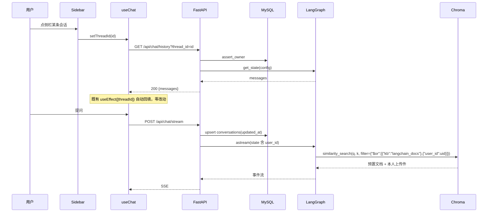

# 会话列表与知识库用户隔离（P3）设计文档

- **日期**：2026-09-13
- **状态**：设计已确认，待实现
- **阶段**：P3（三阶段规划的第三阶段，也是最后阶段）
- **前置**：P1（SqliteSaver 持久化 + 删除对话）、P2（账号鉴权 + `users` / `conversations` 两张表）均已完成
- **分工**：后端由用户实现；接口契约与前端由 AI 产出
- **关联文档**：`2026-09-13-delete-conversation-design.md`、`2026-09-13-p2-account-auth-design.md`、`2026-09-11-kb-upload-design.md`

---

## 1. 背景与问题

| # | 现状 | 证据 |
|---|---|---|
| 1 | P2 留下了**KB 越权窗口**：任何登录用户都能列出、检索到、甚至删除其他用户上传的文档 | P2 spec §6.3、§11「KB 越权窗口」；`function_tools.py:156,192` 的过滤条件只有 `origin="upload"` |
| 2 | **同名替换会删掉别人的文档**（数据丢失级）：A 上传 `笔记.md` 时，`find_upload_doc_ids` 按 `filename + origin=upload` 找旧件并删除，**不区分归属** → B 的同名文档被静默删除且原件落盘一并清掉 | `function_tools.py:120-126`、`upload_service.py:136-141` |
| 3 | 前端仍是**单会话**：`localStorage` 只存一个 `thread_id`，`conversations` 表里攒的历史会话**用户看不到也切不回去** | `frontend/src/hooks/useThreadId.ts:3,17-23` |
| 4 | 检索器被**冻结在单例图里**：`get_retriever()` 的结果经 `build_graph()` 编进 `get_graph()` 的 `@lru_cache` 单例，全进程共享，无法按请求方（用户）过滤 | `backend/app/agent/graph.py:31-32,206,231-233` |
| 5 | 现有 20 个上传文档（`data/uploads/` + 对应向量）**没有 `user_id`**，P3 上线后若不迁移将对所有人不可见 | `data/uploads/` 实测 20 个文件；`upload_service.py:78-86` 的 metadata 无 `user_id` |

## 2. 目标与非目标

### 目标
1. 检索按用户隔离：**预置官方文档全局共享，上传件仅本人可见**
2. 修掉同名替换的跨用户误删
3. KB 列表/删除按归属收窄（删别人的 → `404`，不泄露存在性）
4. 会话列表：侧栏展示当前用户的所有会话，可切换、重命名、删除
5. 一次性迁移脚本，把现有 20 个上传文档归给第一个注册的用户

### 非目标（YAGNI）
- 会话搜索、真分页（只取最近 50 条）、归档/置顶/标签
- 会话分享、导出
- 多人协作同一会话
- KB 容量配额、每用户文档数上限
- 每用户独立 collection（见 §3 决策 3）
- LLM 自动生成会话标题（见 §3 决策 2）
- 管理员视角（看所有用户的会话/文档）
- 侧栏响应式自动折叠（本期只做手动折叠开关）

## 3. 决策记录

| # | 决策 | 选择 | 被否决的方案与理由 |
|---|---|---|---|
| 1 | 侧栏形态 | **常驻左侧栏（250px）+ 手动折叠开关** | ✗ 左侧抽屉：切换会话要点两下；✗ Header 下拉面板：装不下重命名/删除，扩展性最差。<br>**折叠开关是必须的**：对话区是 `w-full max-w-5xl`（上限 1024px），视口 ≥1274px 时加侧栏不影响宽度，但 1024–1274px 会被压窄，用户需要能手动恢复全宽 |
| 2 | 会话标题来源 | **首问前 20 字（P2 已写入）+ 支持手动重命名** | ✗ LLM 生成摘要标题：每次新会话多一次调用（额度 + 延迟），失败还要兜底；✗ 不支持重命名：「帮我看看这段代码为什么不工作」这类开头在列表里全长一样 |
| 3 | KB 隔离方式 | **单 collection + metadata 加 `user_id`，检索时 `where` 过滤** | ✗ 每用户独立 collection：`get_vectorstore()`/`get_graph()` 的 `@lru_cache` 单例要按用户失效重建，Chroma 多 collection 有内存与句柄开销，与既有「单集合 + metadata 过滤」架构决策冲突最大；✗ 不隔离：等于放弃本期目标 |
| 4 | 现有 20 个上传文档归属 | **一次性迁移脚本，归给第一个注册的用户** | ✗ 标记为公共（`user_id=null`）：删除权限要额外定规矩，且与「上传件私有」的模型不一致；✗ 全部清掉：那 20 份笔记（Think In LangGraph、Agentic RAG、幂级数、布隆过滤器…）要重传一遍 |
| 5 | 检索过滤的实现位置 | **`retrieve` 节点内用注入的 vectorstore 直接 `similarity_search`** | ✗ 保留 retriever 单例 + 每请求重建 retriever：retriever 被编译进单例图，重建等于每请求重编图；✗ 双路径（有 user_id 走 vectorstore、无则走 retriever）：测试永远覆盖不到过滤逻辑，而过滤正是本期最该测的东西 |
| 6 | 删他人文档的状态码 | **`404 NOT_FOUND`（沿用既有模式）** | ✗ `403 FORBIDDEN`：会泄露「该 doc_id 存在但不属于你」。现有实现靠过滤条件命中 0 条天然得到 404（`kb_router.py:44-49`），零额外代码且不泄露存在性 |

## 4. 架构与数据流



**切换会话零成本的原因**：`useChat.ts:66-82` 已有 `useEffect([threadId])` → `fetchHistory(threadId)` → `LOAD_HISTORY`。侧栏点击只需改 `threadId`，历史自动回填，**这段逻辑一行都不用改**。

## 5. 🔴 核心架构改动：检索按用户过滤

### 5.1 metadata 事实表（写过滤条件前必须看清）

| 文档来源 | 实际 metadata | 证据 |
|---|---|---|
| **预置官方文档**（88 篇） | `{source, title, kb: "langchain_docs"}` —— **没有 `origin`，没有 `user_id`** | `ingest.py:47-54` |
| **用户上传件** | `{doc_id, filename, origin: "upload", uploaded_at, title, source, size_bytes}` —— **没有 `kb`** | `upload_service.py:78-86` |

> **纠错记录**：本设计初稿写的过滤条件是 `{"$or":[{"origin":"builtin"},{"user_id":X}]}`，**这是错的**——预置文档根本没有 `origin` 字段（`function_tools.py:12-13` 与 `docs/api/README.md:290` 都明写了这一点）。若按初稿实现，88 篇官方文档会全部从检索结果中消失，只剩用户上传件，问答质量断崖式下跌且不报错。正确的标记字段是 `kb`，常量 `BUILTIN_KB = "langchain_docs"` 已在 `function_tools.py:35` 现成可用。

### 5.2 过滤条件

```python
from backend.app.function_tools import BUILTIN_KB

def kb_filter(user_id: int | None) -> dict | None:
    """检索范围：预置官方文档全局共享 + 本人上传件。

    ⚠ Chroma 的 $and / $or **至少要两个子条件**，单条件包一层会抛 ValueError
      （function_tools.py:14-15、项目 README:438）。所以无 user_id 时直接返回
      裸条件，不能写 {"$or": [{"kb": BUILTIN_KB}]}。
    """
    if user_id is None:          # CLI run.py 等无登录态的调用方：只检索预置文档
        return {"kb": BUILTIN_KB}
    return {"$or": [{"kb": BUILTIN_KB}, {"user_id": user_id}]}
```

已验证 `filter` 会透传给 Chroma 的 `where`：`Chroma.similarity_search(query, k, filter)` → `similarity_search_with_score(..., where=filter)`（`langchain_chroma/vectorstores.py:730-754, 817-857`）。类型标注虽写 `dict[str, str]`，实际不做限制，`$or` 嵌套可用。

### 5.3 `retrieve` 节点与 `build_graph` 签名变更

```python
def _make_nodes(model, vectorstore):        # 原为 (model, retriever)
    def retrieve(state: RAGState):
        docs = vectorstore.similarity_search(
            state["question"], k=settings.top_k, filter=kb_filter(state.get("user_id")))
        ...

def build_graph(model=None, vectorstore=None, checkpointer=None):   # retriever → vectorstore
    model = model or get_model()
    vectorstore = vectorstore or get_vectorstore()
    ...
```

`RAGState` 新增字段（`schemas.py:10-15`）：

```python
    user_id: int | None    # 由 chat_service 从 token 注入；CLI / 测试可为 None
```

`get_retriever()`（`graph.py:31-32`）本期**删除**——它唯一的用途就是喂给 `build_graph`，改造后没有调用方。

### 5.4 影响面清单（改签名会波及这些地方）

| 文件 | 位置 | 改动 |
|---|---|---|
| `backend/app/agent/graph.py` | `:11`（模块 docstring）、`:31-32`、`:93`、`:96-100`、`:201`、`:206`、`:227`、`:233` | docstring 更新；删 `get_retriever`；`_make_nodes` 与 `build_graph` 换参数名；`retrieve` 节点改实现 |
| `backend/app/agent/schemas.py` | `:10-15` | `RAGState` 加 `user_id` |
| `backend/app/services/chat_service.py` | `:17-18` | 构造初始 state 时带上 `user_id` |
| `run.py` | `:26` | `build_graph()` 无参调用，**不用改**；但 CLI 无登录态 → `user_id=None` → 只检索预置文档（符合预期，需在 README 说明） |
| `tests/test_graph.py` | `:130, 140, 151, 162, 174` | `retriever=FakeRetriever()` → `vectorstore=FakeVectorStore()` |
| `tests/test_chat_stream.py` | `:51-52` | 同上 |
| `_build_advanced.py` | `:1093` | 该脚本生成的 notebook 文案里写着 `build_graph(model=None, retriever=None)`，**会变成过时文档**，需同步改文案并重新生成对应 notebook |

### 5.5 测试替身升级（本期最大的测试收益）

`FakeRetriever` 只有 `invoke(query)`，**看不见 filter**，所以现有测试完全无法覆盖隔离逻辑。换成：

```python
class FakeVectorStore:
    """记录每次调用收到的 filter，让"按用户隔离"这件事第一次变得可测。"""
    def __init__(self, docs): self.docs, self.calls = docs, []
    def similarity_search(self, query, k=4, filter=None, **kw):
        self.calls.append({"query": query, "k": k, "filter": filter})
        return self.docs[:k]
```

于是可以写出这类断言（P1/P2 时期写不出来）：

```python
def test_retrieve_filters_by_user_id():
    vs = FakeVectorStore([...])
    app = build_graph(model=_model(), vectorstore=vs, checkpointer=InMemorySaver())
    app.invoke({**base_state, "user_id": 7}, {"configurable": {"thread_id": "t1"}})
    assert vs.calls[0]["filter"] == {"$or": [{"kb": "langchain_docs"}, {"user_id": 7}]}

def test_retrieve_without_user_id_only_sees_builtin():
    ...
    assert vs.calls[0]["filter"] == {"kb": "langchain_docs"}   # 注意：不是 $or 单条件
```

## 6. KB 链路的四处过滤改造

| # | 函数 | 现状 | 改为 | 不改的后果 |
|---|---|---|---|---|
| 1 | `upload_service.stream_upload` 的 `meta`（`:78-86`） | 无 `user_id` | 加 `"user_id": user_id` | 新上传件无法归属，检索过滤匹配不到 → **自己上传的文档自己检索不到** |
| 2 | `find_upload_doc_ids(filename)`（`function_tools.py:120-126`） | `{"$and":[{"filename":X},{"origin":"upload"}]}` | `{"$and":[{"filename":X},{"origin":"upload"},{"user_id":uid}]}`（三条件，满足 ≥2 的要求） | **A 上传同名文件会删掉 B 的文档与原件**（§1 问题 2，数据丢失级） |
| 3 | `get_upload_doc(doc_id)`（`:129-147`） | `{"$and":[{"doc_id":X},{"origin":"upload"}]}` | 加 `{"user_id":uid}` | 能看到别人文档的元信息（filename/title/大小） |
| 4 | `list_upload_docs()`（`:150-173`） | `where={"origin":"upload"}` | `{"$and":[{"origin":"upload"},{"user_id":uid}]}` | 列表里出现别人的文档 |
| 5 | `delete_upload_doc(doc_id)`（`:185-197`） | `{"$and":[{"doc_id":X},{"origin":"upload"}]}` | 加 `{"user_id":uid}` | **能删别人的文档**；加了之后命中 0 条 → 上层自然返回 404（决策 6） |

**不改的**：
- `builtin_stats()`（`:176-182`）：统计的是预置文档，**全局共享**，不加 user 过滤
- `remove_upload_copies(doc_id)`（`:217-220`）：按 `doc_id` glob 落盘原件，`doc_id` 是 uuid 天然唯一，无需过滤
- `_safe_disk_name` / `save_upload_copy`：与归属无关

**这四个函数都要加 `user_id` 参数**，签名变更后 `kb_router.py` 的三个端点需把 `current_user.id` 传进去。

## 7. 接口契约

### 7.1 新增端点

| 方法 | 路径 | 请求体 | 成功 | 失败 |
|---|---|---|---|---|
| GET | `/api/chat/threads` | — | `200 {threads:[{thread_id,title,created_at,updated_at}], total}` | `401 UNAUTHORIZED` |
| PATCH | `/api/chat/threads/{thread_id}` | `{title}` | `200 {thread_id, title}` | `401`、`403 FORBIDDEN`（非本人）、`404 NOT_FOUND`（不存在）、`422 VALIDATION_ERROR`（标题空或超 60 字） |

`GET /api/chat/threads`：只返回当前用户的会话，按 `updated_at` **倒序**，**最多 50 条**（`total` 返回真实总数，前端据此显示「仅显示最近 50 条」）。空列表返回 `200 {threads:[], total:0}`，不是 404。

### 7.2 既有端点的行为变化（**字段结构全部不变**）

| 端点 | 变化 |
|---|---|
| `POST /api/chat/stream` | state 里带 `user_id`；检索范围变为「预置 + 本人上传」 |
| `GET /api/kb/documents` | `documents` 只含**本人**上传件；`builtin` 摘要仍是全局统计 |
| `POST /api/kb/documents` | 写入 `user_id` metadata；同名替换只在**本人**范围内检测 |
| `DELETE /api/kb/documents/{doc_id}` | 只删本人的；删别人的 → 命中 0 条 → `404 NOT_FOUND`（**不是 403**，不泄露存在性） |
| `DELETE /api/chat/threads/{thread_id}` | 除删 checkpoint + `conversations` 行外，**行为不变**（P1 的幂等语义、P2 的归属校验都保留） |

### 7.3 错误码

**不新增**。复用 P2 的 `FORBIDDEN`(403) / `NOT_FOUND`(404) / `UNAUTHORIZED`(401) / `VALIDATION_ERROR`(422)，`ErrorCode` 保持 14 个。

### 7.4 curl 样例

```bash
# 会话列表
curl -s http://localhost:8000/api/chat/threads -H "Authorization: Bearer $TOKEN"
# {"threads":[{"thread_id":"2f1c9a04-…","title":"checkpointer 怎么删会话",
#              "created_at":"2026-09-13T06:12:44Z","updated_at":"2026-09-13T06:20:10Z"}],
#  "total":1}

# 重命名
curl -s -X PATCH http://localhost:8000/api/chat/threads/2f1c9a04-6b7e-4d21-9c33-1ab2cd34ef56 \
  -H "Authorization: Bearer $TOKEN" -H "Content-Type: application/json" \
  -d '{"title":"会话删除与持久化"}'
# {"thread_id":"2f1c9a04-6b7e-4d21-9c33-1ab2cd34ef56","title":"会话删除与持久化"}

# 重命名别人的会话
curl -i -X PATCH http://localhost:8000/api/chat/threads/<别人的id> \
  -H "Authorization: Bearer $TOKEN" -H "Content-Type: application/json" -d '{"title":"x"}'
# HTTP/1.1 403 Forbidden
# {"code":"FORBIDDEN","message":"该会话不属于当前用户"}

# 删别人的上传文档 → 404（不是 403，不泄露存在性）
curl -i -X DELETE http://localhost:8000/api/kb/documents/<别人的doc_id> \
  -H "Authorization: Bearer $TOKEN"
# HTTP/1.1 404 Not Found
# {"code":"NOT_FOUND","message":"文档不存在: …"}
```

### 7.5 契约文件改动位置

| 文件 | 位置 | 改动 |
|---|---|---|
| `docs/api/openapi.yaml` | `paths` 的 chat 段 | 新增 `/api/chat/threads`（get）与 `/api/chat/threads/{thread_id}`（patch；delete 已存在，补 403/404 响应） |
| `docs/api/openapi.yaml` | `components.schemas` | 新增 `ConversationSummary`、`ThreadListResponse`、`RenameRequest` |
| `docs/api/README.md` | 端点表 | 新增 2 行 |
| `docs/api/README.md` | 知识库端点章节 | metadata 约定表**新增 `user_id` 行**；补一段「预置文档用 `kb="langchain_docs"` 标记、不带 `origin`」的事实说明（当前 `:290` 只说了不带 `origin`，没说带什么） |
| `docs/api/README.md` | 新增「会话列表」章节 | 列表/重命名/切换语义、50 条上限、与删除的关系 |
| `docs/api/README.md` | 新增「多用户与数据隔离」章节 | 检索范围公式、KB 归属规则、404 而非 403 的理由、迁移脚本说明 |

## 8. 数据模型

**本期无 schema 变更**。`conversations` 在 P2 已建齐全部字段（`thread_id` / `user_id` / `title` / `created_at` / `updated_at`）与索引 `ix_conversations_user_updated (user_id, updated_at DESC)`——正是 §7.1 列表查询要用的。

`title` 也已在 P2 的首次提问 upsert 时写入，所以**本期无需回填历史数据**。

## 9. 旧数据迁移脚本

`scripts/migrate_kb_user_id.py`（一次性，P3 上线时跑）

### 9.1 为什么必须跑

P3 上线后检索过滤变成 `{"$or":[{"kb":"langchain_docs"},{"user_id":uid}]}`。现有 20 个上传文档的向量**没有 `user_id`**，两个子条件都不匹配 → **对所有人（包括原上传者）彻底不可见**，且 KB 列表也查不到（§6 第 4 项）。不迁移等于这 20 份资料凭空消失。

### 9.2 关键实现约束

1. **必须走 raw collection，不能走 LangChain 的 `add_documents`**：
   ```python
   col = get_vectorstore()._collection          # 与 function_tools._collection() 同一路径
   col.update(ids=batch_ids, metadatas=batch_metas)
   ```
   已验证：`chromadb/api/models/CollectionCommon.py:388-399` 中，只有当 `documents` 或 `images` 非 None 时才调 `_embed_record_set`；**只传 `ids` + `metadatas` 时 `update_embeddings = None`，零嵌入调用、零 DashScope 额度消耗**。
   > `function_tools.py:11` 写的「Chroma 事后补 metadata 等于整块重新嵌入」只对 LangChain 的 `add_documents` 路径成立（它总会调嵌入接口），对 raw `update` 不成立。建议顺手把那句注释补充清楚，免得后来者以为迁移很贵。

2. **`update` 是整体替换 metadata，不是合并** → 必须先读出现有 metadata，再 `{**old, "user_id": uid}` 传回去，否则 `doc_id`/`filename`/`origin`/`uploaded_at` 会全部丢失，文档立刻变成孤儿。

3. **分批**：一次 `get` 可能返回上万段（预置 2885 + 上传若干），`update` 按每批 500 条处理，避免单请求过大。

4. **幂等**：`where={"$and":[{"origin":"upload"}]}` 取回后，在 Python 里跳过已有 `user_id` 的段。重复跑不出错。

5. **归属对象**：`SELECT id, username FROM users ORDER BY id LIMIT 1` —— 第一个注册的用户。脚本启动时打印该用户名并要求 `--yes` 确认（或 `--user <username>` 显式指定），避免归错人。

6. **`--dry-run`**：只打印「将影响 N 段向量、M 个文档、归属给 <username>」，不写入。**必须先跑一次 dry-run**。

### 9.3 验收

```bash
python scripts/migrate_kb_user_id.py --dry-run     # 看数量对不对（应为 20 个文档）
python scripts/migrate_kb_user_id.py --yes         # 实际写入
python scripts/migrate_kb_user_id.py --dry-run     # 再跑应显示 0 段待迁移（幂等）
```

跑完后用第一个用户的 token 调 `GET /api/kb/documents`，应看到这 20 个文档；用第二个用户的 token 调，应看到空列表。

## 10. 前端实现设计

### 10.1 文件清单

| 文件 | 动作 | 职责 |
|---|---|---|
| `src/api/types.ts` | 改 | `ConversationSummary`、`ThreadListResponse`、`RenameRequest` |
| `src/api/client.ts` | 改 | `fetchThreads()`、`renameThread(id, title)`（都走 P2 的 `request()`，自动带 token） |
| `src/hooks/useConversations.ts` | **新建** | `{threads, total, loading, error, refresh, rename, remove}` + 乐观更新 |
| `src/hooks/useThreadId.ts` | 改 | 暴露 `setThreadId(id)`（当前只有 `resetThreadId`），供侧栏切换 |
| `src/hooks/useSidebar.ts` | **新建** | 折叠状态，持久化到 `localStorage['ragqa_sidebar_collapsed']` |
| `src/components/Sidebar.tsx` | **新建** | 会话列表 + 折叠按钮 + 重命名交互 + 每项删除按钮 |
| `src/components/ConversationItem.tsx` | **新建** | 单条：标题、相对时间、hover 出 ✎ 与 🗑 |
| `src/App.tsx` | 改 | 外壳从纵向 flex 改**横向 flex**（Sidebar + 主区）；接线 |
| `src/components/Header.tsx` | 改 | 「＋ 新对话」保留；P1 的「🗑 删除对话」保留（删当前会话） |
| `mock/server.mjs` | 改 | `GET /api/chat/threads`、`PATCH /api/chat/threads/:id`；内存 threads 表带 title/时间戳 |
| `src/test/useConversations.test.ts` | **新建** | +7 用例 |
| `src/test/sidebar.test.tsx` | **新建** | +8 用例 |
| `src/test/conversation-item.test.tsx` | **新建** | +5 用例 |
| `src/test/app.test.tsx` | 改 | 适配横向外壳，+3 用例（切换会话、折叠持久化） |
| `src/test/client.test.ts` | 改 | +2 用例 |
| `frontend/README.md` | 改 | 补侧栏、折叠、会话切换与重命名说明 |

### 10.2 App 外壳改造

```tsx
<div className="flex h-screen bg-gray-50">
  <Sidebar collapsed={sb.collapsed} onToggle={sb.toggle} ... />
  <div className="flex min-w-0 flex-1 flex-col">   {/* min-w-0 是关键：
        flex 子项默认 min-width:auto，长标题会把侧栏顶开、把对话区挤出屏幕 */}
    <Header ... />
    <ChatWindow messages={messages} />
    <Composer ... />
  </div>
  <KnowledgeBaseDrawer ... />
</div>
```

侧栏宽度：展开 `w-[250px] shrink-0`，折叠 `w-0`（内容 `overflow-hidden`）+ 一个绝对定位的 `»` 把手。**加 `transition-[width] duration-150`** 让折叠有动画。

### 10.3 会话切换（复用既有机制，零新增逻辑）

```tsx
const switchTo = (id: string) => {
  if (id === threadId) return;
  abort();                       // 正在流式输出时先中断，否则旧流的事件会写进新会话的气泡
  setThreadId(id);               // useChat 的 useEffect([threadId]) 自动 fetchHistory 回填
};
```

> **`abort()` 是必须的**：`useChat.ts` 的 SSE 回调直接 dispatch 到「最后一条 assistant 消息」，切换会话后若不中断，旧会话的 token 会追加到新会话的气泡里。

`LOAD_HISTORY` 的既有守卫是「仅当当前无消息时回填」（`useChat.ts:53-55`），**切换会话时当前有消息 → 会被这个守卫挡掉**。所以需要放宽：`LOAD_HISTORY` 携带目标 `threadId`，仅当 `action.threadId === 当前 threadId` 时才回填。这是本期**唯一需要改动既有聊天逻辑**的地方，必须有测试覆盖（否则切换会话后界面显示的还是上一个会话的内容）。

### 10.4 「＋ 新对话」后的侧栏刷新

新会话的 `conversations` 行是后端在**首次提问时** upsert 出来的，所以侧栏刷新的时机是 `done` 事件之后，不是点「新对话」时：

```tsx
// useChat 的 onDone 回调里，除 dispatch FINISH 外再触发一次会话列表刷新
onDone: e => { dispatch({ type: 'FINISH', grounded: e.grounded }); refreshThreads(); }
```

`refreshThreads` 通过 props 或一个轻量事件总线传入 `useChat`。**推荐 props**（`useChat({ onThreadTouched })`），避免引入全局状态。

### 10.5 重命名交互

- 条目 hover 出现 ✎（`data-testid="rename-btn"`）
- 点击 → 标题变 `<input>`（`data-testid="rename-input"`），预填当前标题、全选
- `Enter` 提交 `PATCH`；`Esc` 取消；失焦提交（与 Enter 同路径）
- **乐观更新**：先改本地，失败回滚并显示行内错误（沿用 `useKnowledgeBase.removeDoc` 的既有模式）
- 空标题或超 60 字：前端直接拦下不发请求，显示行内提示

### 10.6 侧栏内删除

每条会话 hover 出 🗑 → 复用 P1 的 `ConfirmDialog`：

- 删的是**当前打开的会话** → 删除成功后清空消息区，并自动切到列表第一条（列表空则 `resetThreadId()` 开新会话）
- 删的是**其他会话** → 只从列表移除，消息区不动
- 两种情况都要 `refresh()` 拿准 `total`

## 11. 错误处理矩阵

| 情况 | 后端 | 前端 |
|---|---|---|
| 列表为空 | `200 {threads:[],total:0}` | 侧栏显示「还没有会话，问一句就开始」 |
| 列表请求失败 | 5xx / 网络 | 侧栏显示错误行 + 「重试」按钮，**不影响聊天** |
| 重命名非本人会话 | `403 FORBIDDEN` | 回滚标题 + 行内错误 |
| 重命名不存在的会话 | `404 NOT_FOUND` | 回滚 + 从列表移除该项 + 刷新 |
| 标题为空/超 60 字 | `422 VALIDATION_ERROR` | 前端已拦，不会发出；若仍收到则显示行内错误 |
| 删他人上传文档 | `404 NOT_FOUND`（过滤命中 0） | KB 抽屉显示「文档不存在」，刷新列表 |
| 切换会话时 history 403 | `403 FORBIDDEN` | 消息区显示错误 + 从侧栏移除该项（数据已不属于自己） |
| 迁移脚本未跑 | 上传件检索不到、列表为空 | 无异常，只是「文档凭空消失」→ **上线清单必须包含迁移**（§13） |

## 12. 测试策略

### 12.1 后端 pytest

| # | 用例 | 断言重点 |
|---|---|---|
| 1 | `test_retrieve_filter_with_user_id` | filter == `{"$or":[{"kb":"langchain_docs"},{"user_id":7}]}` |
| 2 | `test_retrieve_filter_without_user_id` | filter == `{"kb":"langchain_docs"}`（**不是 `$or` 单条件**，那会抛 ValueError） |
| 3 | `test_kb_filter_never_uses_origin_builtin` | 钉住 §5.1 的纠错：过滤条件里不得出现 `origin: "builtin"` |
| 4 | `test_list_threads_only_own` | 两个用户各建会话，各自只看到自己的 |
| 5 | `test_list_threads_ordered_by_updated_at_desc` | 新提问的会话排到最前 |
| 6 | `test_list_threads_limit_50_and_total` | 造 55 条，返回 50 条 + `total=55` |
| 7 | `test_rename_own_thread` / `test_rename_other_users_thread_403` / `test_rename_missing_404` | |
| 8 | `test_upload_writes_user_id_metadata` | 上传后 metadata 含 `user_id` |
| 9 | `test_same_filename_different_user_does_not_delete_others` | **§1 问题 2 的回归测试**：A、B 各传 `笔记.md`，A 再传一次同名 → B 的文档与原件都还在 |
| 10 | `test_list_docs_only_own` / `test_delete_other_users_doc_404` | 404 而非 403 |
| 11 | `test_builtin_stats_is_global` | 两个用户看到的 `builtin` 摘要相同 |
| 12 | `test_migration_script_is_idempotent`（用临时 Chroma 目录） | 跑两次，第二次 0 段变更；且 `doc_id`/`filename`/`origin` 未丢失 |

### 12.2 前端 vitest

| 文件 | 数量 | 重点 |
|---|---|---|
| `useConversations.test.ts` | +7 | 列表加载、刷新、重命名乐观更新与回滚、删除当前 vs 其他会话 |
| `sidebar.test.tsx` | +8 | 折叠开关与 localStorage 持久化、空列表文案、错误行与重试、当前项高亮 |
| `conversation-item.test.tsx` | +5 | hover 出按钮、Enter 提交、Esc 取消、空标题拦截 |
| `app.test.tsx` | +3 | **切换会话后消息区换成新会话内容**（覆盖 §10.3 的 `LOAD_HISTORY` 守卫放宽）、切换时 abort 被调、新对话后列表刷新 |
| `client.test.ts` | +2 | `fetchThreads` / `renameThread` 的 URL、method、body |
| `useChat.test.ts` | +2 | `LOAD_HISTORY` 携带 threadId 的守卫行为（匹配才回填、不匹配则忽略） |

预计前端测试总数 **83（P1 后）+ 17（P2）+ 27 = 127**（以实际为准）。

## 13. 上线顺序（**顺序错了会丢数据可见性**）

1. 确认 P2 已上线且**至少注册了一个用户**（迁移脚本需要归属对象）
2. `python scripts/migrate_kb_user_id.py --dry-run` → 核对数量为 20 个文档
3. `python scripts/migrate_kb_user_id.py --yes` → 实际迁移
4. 再跑一次 `--dry-run` → 应显示 0 段待迁移（验证幂等）
5. 部署 P3 后端代码（检索过滤 + KB 归属 + 会话列表端点）
6. 跑 §12.1 的 12 个后端用例
7. 部署前端，跑 vitest + build
8. 手工验收：用户 A 能看到并检索那 20 份文档；用户 B 的 KB 列表为空、检索不到 A 的文档、但**能检索到 88 篇官方文档**（这一条验证 §5.1 的纠错没走偏）

> **第 3 步与第 5 步不能颠倒**：先部署代码再迁移，会有一段时间所有上传件对所有人不可见；先迁移再部署则无副作用（多出来的 `user_id` 字段在旧代码下被忽略）。

## 14. 遗留项与技术债

| 项 | 说明 |
|---|---|
| CLI `run.py` 只检索预置文档 | 无登录态 → `user_id=None`。这是刻意行为，但需在项目 README 里写明，否则会被当成 bug |
| `_build_advanced.py:1093` 的 notebook 文案 | 提到 `build_graph(model=None, retriever=None)`，本期改名后会过时，需同步并重新生成 notebook |
| 会话列表只取最近 50 条 | 无真分页；会话极多的老用户看不到更早的（可用 P1 的删除功能清理） |
| 无会话搜索 | 50 条以内靠肉眼；超过后需要搜索或分页 |
| KB 无配额 | 单用户可无限上传（仍受单文件 20MB 限制） |
| `function_tools.py:11` 的注释 | 「补 metadata 等于重新嵌入」的说法只对 LangChain 路径成立，建议补一句说明 raw `_collection.update()` 不重嵌（§9.2 第 1 项） |
| 预置文档无 `origin` 字段 | 历史遗留（`docs/api/README.md:290` 明写「保持现状不带 `origin`」）。本期用 `kb` 字段区分是正确做法，但两类文档的 metadata 形状不一致这件事本身是长期噪音源；若将来要统一，需 `ingest.py --force` 全量重嵌（2885 段，有额度成本） |
